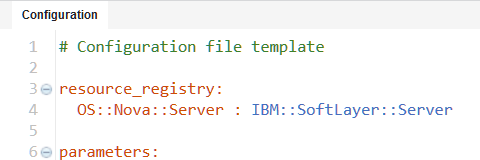
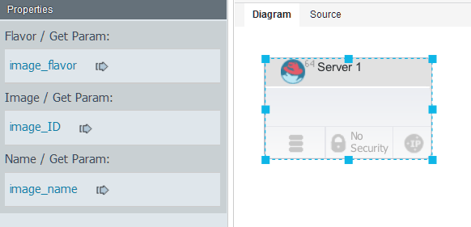

# Editing configuration files

Configuration files are lists of properties and values. You can use configuration files to provision the same blueprint on multiple cloud systems.

Create a blueprint. Configuration files apply only to blueprints that you create in the blueprint designer, not blueprints that you create with the HCL® UrbanCode™ Deploy server.

In most cases, you create a blueprint with a default set of properties. Then, you use one or more configuration files to customize provisioning for specific clouds or specific situations. Since blueprints use only the properties in the configuration file that apply to it, you can also use a configuration file with more than one blueprint.

Configuration files are not necessary if you are deploying to OpenStack and OpenStack-based clouds. If you are deploying to any other supported cloud, you must use a configuration file.

The editor for configuration files is similar to the editor for blueprint source code. You can specify properties in a configuration file and substitute those properties when you provision the environment.

1.  Follow these steps to create a configuration file:
2.  In the blueprint editor, click **New**. 
3.  In the Add a New File window, specify a name and description for the configuration file.
4.   If your workspace contains multiple repositories, select a project from the **Repository** list. If your workspace contains one repository, the **Repository** list is not displayed.
5.   In the **Type** list, select the configuration file type. 
6.   Click **Save**. The new configuration file opens in the editor. By default, if you created a configuration file for a cloud other than OpenStack, the configuration file includes resource type mappings. These resource type mappings translate the OpenStack resource types in the blueprint to the appropriate resource types for the target cloud. For example, if you created a configuration file for SoftLayer® clouds, the file maps the OpenStack resource type `OS::Nova::Server` to the SoftLayer resource type `IBM::SoftLayer::Server`, as shown in the following configuration file:

    

7.   To import properties from a blueprint, click **Add** , then select the blueprint, and then click **OK**. 

    **Note:** You can import properties from more than one blueprint. In this case, the editor shows warnings on properties that exist in one blueprint but not in another. When you provision a blueprint, the blueprint uses only the properties in the configuration file that apply to it.

8.  In the configuration file, specify the properties for the deployment on the target cloud.

Now you can use this configuration file when you provision the environment. You can create multiple configuration files to customize blueprints for different situations or clouds.

For example, suppose that your cloud systems provide different virtual images. Start by creating virtual images from one of the clouds in a blueprint, or use referenced images to represent generic images. Then, externalize each of the properties in the virtual images. In the following figure, the flavor, image ID, and name of the virtual image are bound to properties that are named `image_flavor`, `image_ID`, and `image_name`.



The code for the blueprint shows the property names rather than literal values, as in the following example code:

```
virtual-image:
  type: OS::Nova::Server
  properties:
    flavor: { get_param: image_flavor }
    image: { get_param: image_ID }
    name: { get_param: image_name }
```

Then, create a different configuration file for each cloud, import these properties, and specify values for a specific cloud system, as in the following example of a configuration file.

```
parameters:
  image_name: virtual-image
  image_ID: aea5549c-892f-4c67-a3c9-9f494f1c7ead
  image_flavor: m1.small
```

**Parent topic:** [Editing blueprints with the blueprint designer](../../com.edt.doc/topics/blueprint_create.md)

