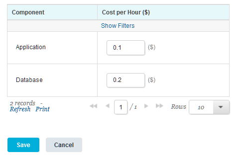

# Specifying costs for HCL UrbanCode Deploy components

If components have a cost to deploy, you can assign a cost to them. Then, when you provision an environment, the blueprint design server includes the cost of the components in the cost estimate for the environment.

Connect the blueprint design server to the server. See [Connecting the blueprint design server to the server](../../com.udeploy.doc/topics/ucdp_integrate.md).

1.   In the blueprint designer, as an administrator, click **Settings** \> **Cost Centers**. 
2.  Click **Add Cost Center**.
3.  Specify a name for the cost center, such as HCL® UrbanCode™ Deploy components. 
4.  In the **Source** list, select **UrbanCode Deploy**.
5.  Click **Save**.
6.  Add one or more components to the cost center: 
    1.  In the **Cost Centers** section, click the new cost center to select it.
    2.  In the **Component** list, click **Add Component**.
    3.   In the **Component Id** field, specify the ID of the component in HCL UrbanCode Deploy. 
    4.  In the **Name** field, specify the name of the component on the HCL UrbanCode Deploy server. 
    5.  Click **Save**.
    6.  Repeat the process to add components to the cost center. 
7.  Specify the cost per hour of the components: 

    1.  With the cost center selected, go to the **Cost Metrics** tab.
    2.  In the table of components, specify the cost per hour of each component.
    3.  Click **Save**.
    The table of components shows the cost per hour of each component, as shown in the following image. The image shows two components. The `Application` component costs $0.10 per hour, and the `Database` component costs $0.20 per hour.

    

When you provision an environment from the blueprint designer as described in [Provisioning environments from the blueprint designer \(through OpenStack Heat\)](env_provision_edt.md), the blueprint design server includes the cost of the components in the cost estimate. To find the cost of the components, the blueprint design server first retrieves values from the ID and name fields of the components in the blueprint. Then, it looks for matching IDs and names in the cost center. It adds the cost of the components to the costs from any other cost centers that are associated with the cloud.

**Note:** You cannot estimate the cost for cloud environments that you provisioned by using a composite blueprint.

**Parent topic:** [Estimating the cost for cloud environments](../../com.edt.doc/topics/cost_ov.md)

**Parent topic:** [Estimating the cost for cloud environments](../../com.udeploy.doc/topics/cost_ov.md)

