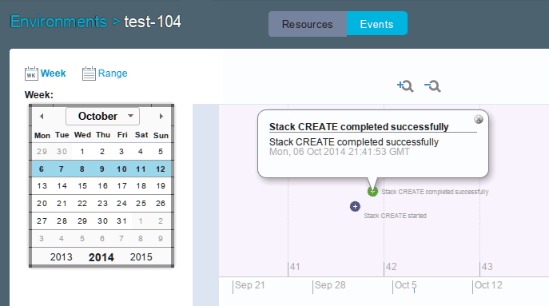

# Configuring messaging with event sources

To receive messages from the OpenStack Heat-based cloud system, you can configure an event source in the blueprint designer. This event source accepts messages from a messaging system and shows those messages in the log for an environment.

If you extended an existing Heat engine as described in [Extending an existing OpenStack engine](../../com.udeploy.install.doc/topics/extending_an_engine_for_openstack.md), ensure that messaging is turned on and configured. You must have the information in the /etc/rabbitmq/rabbitmq-env.conf file to set up messaging for the blueprint design server.

By default, the engines that you install for the blueprint design server include a RabbitMQ messaging system. You can configure this messaging system to show information about the deployments that are running, such as messages when environments are created.

**Note:** By default, the event sources feature is disabled. To enable the event sources feature, you must add `feature.flags=eventSources` to the `server.properties` file.

1.   If your engine is not on the same computer as the blueprint design server, follow these steps to configure the engine to provide messages to the blueprint design server. 
    1.   On the engine, open the /etc/rabbitmq/rabbitmq-env.conf file. 
    2.   In this file, in the NODE\_IP\_ADDRESS parameter, specify the IP address of the blueprint design server. The messaging server provides messages only to requests from this IP address. As an alternative, you can specify `0.0.0.0` for the messaging server to provide messages to any system, as in the following example:

        ```
        NODE_IP_ADDRESS=0.0.0.0
        ```

    3.   Save the file. 
    4.   Restart the RabbitMQ server. For example, if your engine host operating system is Red Hat Enterprise Linux™, version 7, run the following command:

        ```
        systemctl restart rabbitmq-server.service
        ```

        If your engine is on the same computer, you do not need to edit the /etc/rabbitmq/rabbitmq-env.conf file.

2.  Follow these steps to configure the blueprint design server to receive messages from the engine:
3.   In the blueprint designer, as an administrator, click **Settings** \> **Events**. 
4.  On the **Event Sources** tab, click **Add Event Sources** and specify the following information: 

    |Property|Description|
    |--------|-----------|
    |**Name**|An identifier for the event source.|
    |**Event source Type**|The type of message queue.|
    |**Host**|The host name or IP address of the engine. If the engine and blueprint design server are on the same computer, specify `127.0.0.1` .|
    |**Port**|The port for the message queue. The default value is 5672.|
    |**Exchange Name**|The name of the exchange from which messages are taken. The default value is `heat`.|
    |**Routing Key**|The name of the routing key with which to select messages. The default value is `notifications.info`.|
    |**Username**|The user name of the account that is associated with the message queue. The default value is `guest` .|
    |**Password**|The password of the account that is associated with the message queue. The default value is `guest` .|

5.  Click **Save**.

When you provision an environment, you can open the environment and see the messages on the **Events** tab. Specifically, the blueprint design server can accept information for events of the following types:

-   `orchestration.stack`, such as `orchestration.stack.create.start` and `orchestration.stack.suspend.end`.
-   `orchestration.autoscaling`, such as `orchestration.autoscaling.start`.

The following image shows an example of the messages that the **Events** tab displays. The calendar view on the right side of the page shows the `orchestration.stack.create.start` event, which means that the provisioning process started. The `orchestration.stack.create.end` event shows that the provisioning process is complete.



**Parent topic:** [Blueprint design server configuration](../../com.edt.doc/topics/c_node_administering_bds.md)

**Parent topic:** [Managing security](../../com.udeploy.admin.doc/topics/security_ch.md)

