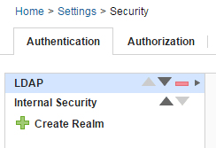

# Authentication realms

Authentication realms manage users and determine user identity within authorization realms for the server.

Users can be created manually or imported from external systems, such as LDAP. Authentication is determined following the hierarchy of realms that is displayed on the **Authentication** tab. In the following figure, authentication is first determined in the Internal Security realm followed by the LDAP realm. A user who is listed in the LDAP realm can have different authorizations from those in the other realms.

If you have a number of authentication realms, you can reorder them by using the operation tools. Each realm can be moved up to a higher priority, moved down, or deleted by using the operation tools.

For information about authorization realms, see [Authorization realms](security_config.md).

-   **[Creating authentication realms](../../com.udeploy.admin.doc/topics/security_auth_create.md)**  
To create an authentication realm on the server, specify where to store information about the users, such as internal storage on the server, a single sign-on service, or on an LDAP server.
-   **[Creating users manually](../../com.udeploy.admin.doc/topics/security_user_create.md)**  
You can manually create users on the server for internal security and SSO type authentication realms.
-   **[Editing user information manually](../../com.udeploy.admin.doc/topics/security_user_edit.md)**  
You can manually edit the stored name, email address, and password for user accounts on the server for internal security and SSO type authentication realms.
-   **[Importing LDAP users](../../com.udeploy.admin.doc/topics/security_user_import.md)**  
On the server, LDAP authentication realm users are imported from external LDAP systems.
-   **[Updating LDAP users](../../com.udeploy.admin.doc/topics/security_user_update.md)**  
Names and email addresses for LDAP users can be updated in a batch process.

**Parent topic:** [Managing security](../../com.udeploy.admin.doc/topics/security_ch.md)

