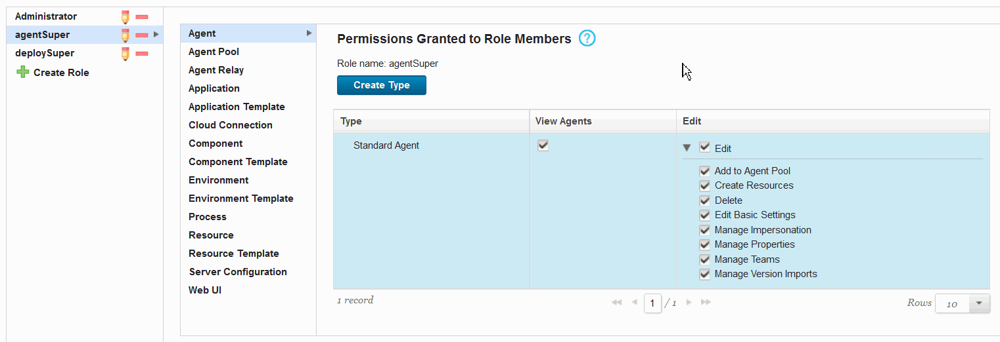

# Creating roles and assigning permissions

You can create roles on the server and assign permissions to them.

By default, new roles have no permissions. Therefore, when you create a role, you must add all the permissions for that role. For example, if you do not add permission to view the pages of the server user interface in the **Web UI** section, users can log in to the server but cannot see any information.

Several default roles are available. These roles have matching default users.

-   **Administrator**: This role has all permissions. It is appropriate for administrators.
-   **Automation Engineer**: This is an example of a role for a typical non-adminstrator user. It includes permissions to create and edit most things on the server, including applications, component, and processes, but not the permission to delete things, change permissions, or change system settings.
-   **UC Auto Configure**: This role has the permissions to create resources.
-   **UC Auto Discovery**: This role is used by plug-ins that discover information about systems, such as the WebSphere® Application Server - Deploy plug-in.
-   **UC Version Import**: This role has only the permission to manage versions.

1.   On the server, click **Settings** \> **Role Configuration**. 
2.  In the Role Configuration pane, click **Create Role**.
3.   In the Create User Role dialog box, enter a name for the role, and then click **Save**. 
4.   Click the role to select it. 
5.   With the role selected, select the object type to which you want to assign permissions, such as environments, applications, or components. All security types for the selected object type are displayed. For information about creating security types, see [Creating security types](security_types_create.md#).

    In the following figure, the security types for the **Agent** product area are displayed. Because the agentSuper role is selected, only that role is affected by permission changes to the Standard Agent and agentManager security types. That is, if you select the **Agent** object type for the deploySuper role, the granted permissions reflect the settings that were defined the last time that role was modified.

    **Tip:** If you upgraded to version 6.2.2, some users might no be unable to see agent relays in the user interface, even though they were visible before the upgrade. You can set the permission for these users to view agent relays: Click **Agent Relay** in the permissions area list, and then select **View Agent Relays**.

    

6.  In the Permissions Granted to Role Members pane, grant permissions by selecting the associated check box for a security type.You can select all edit subpermissions by selecting the **Edit** check box. To deselect all subpermissions, clear the corresponding check boxes. Select individual subpermissions by expanding the **Edit** list and clicking the corresponding check boxes. For information about editing subpermissions, see [Security types](security_types.md#)

    **Note:** If a role grants the Create permission for some object type, such as components, it is important that the role also grant the Edit Basic Settings and Manage Teams permissions for that type. Otherwise, the options for creating the object are limited.

    For information on the permissions that are available, see [Permission reference](security_roles_permission_ref.md).

7.   Click the **Web UI** category, and specify the pages in the server user interface that the role can access. Each option in this list refers to a top-level page in the user interface. For example, if you do not select the **Applications Tab** option in this list, users with this role do not see the top-level **Applications** tab when they log in to the server. You can select each tab separately.
8.   If the role users need system permissions, such as the ability to change permissions, click **Server Configuration**, and specify those permissions. For more information, see [Setting server configuration security](security_system.md).

Assign roles to users by adding users or groups to teams. You cannot assign a role to a user directly; users must be assigned roles when they are added to teams. See [Assigning users to teams](security_teams_users.md).

**Parent topic:** [Roles and permissions](../../com.udeploy.admin.doc/topics/security_roles.md)

