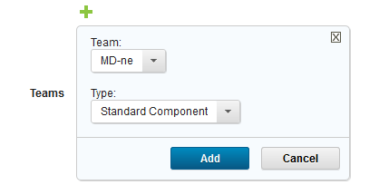

# Assigning teams directly to items

You can assign a team to an object \(such as components or applications\) when you create the object.

You can assign your teams to the objects that you create. When a team is assigned to an object, only team members with the appropriate permissions can interact with the affected object. To assign a team, the assigner must be a team member and have the manage teams subpermission.

Teams can be assigned when an object is created \(in the associated Create item window\) and by using the Configuration page after the item is created.

You can also assign teams by mapping a team to the object by using the mapping security feature. See [Mapping teams to objects](security_teams_mapping.md#).

**Note:** By default, new objects are assigned to all the teams that you are a member of. To specify which teams to assign new objects to, see [Setting the teams for your account](prefs_teams.md).

1.   On the server, open the **Configuration** pane or Create dialog box for an object, such as a component. For a list of product areas that you can assign teams to, see [Security types](security_types.md). 

    In the following figure, the **Teams** field is displayed in the Create Component window.

    

2.   Click the plus-sign , and then select a team from the **Teams** list. 
3.   Select a security type for the object from the **Type** list. The type defines the set of object permissions that are available to the team. Security types for the current object type are available. Initially, a type of object, such as components, has a single type that is defined for it, the standard type. For information about security types, see [Security types](security_types.md#). 
4.  Click **Add**. More than one team can be added to an item.The selected team or teams can interact with the object immediately. Teams and their security type are listed on the Configuration page that is associated with the object. In the following figure, the NE-1 team with the cHolder security type is assigned to a component.

    

5.  To remove a team from an object, click the cancel icon  for the team.

**Parent topic:** [Security teams](../../com.udeploy.admin.doc/topics/security_teams.md)

