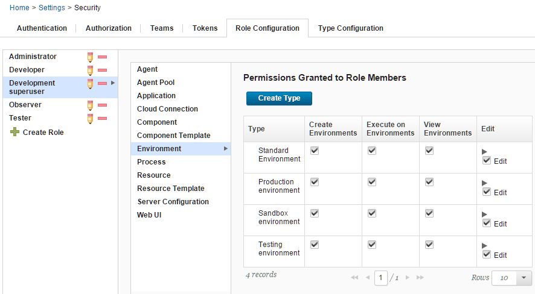
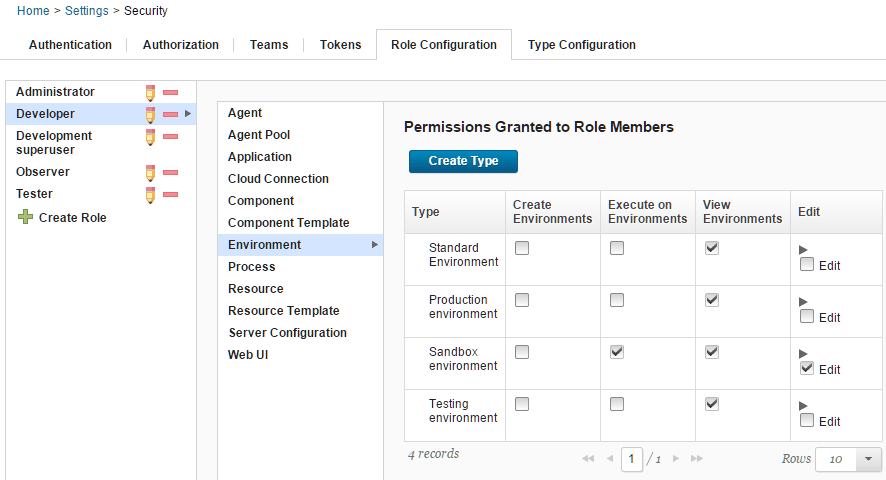

# Security types

Security types define categories of objects on the server. You can put all objects into a single category, or you can put them in separate categories and give roles different access rights to different categories.

By default, all object types on the server have a standard security type. For example, applications have the Standard Application security type, and environments have the Standard Environment security type. You do not have to create more security types unless you want to give different levels of access to different roles.

For example, suppose that you have different environment categories for different purposes, such as production environments, testing environments, and sandbox environments. You want to give different users different levels of access to these environments. You can allow only development superusers to modify production environments but allow other users to view the state of these environments. You can also allow anyone to modify sandbox environments.

In this case, you create security types for different categories of environments and assign the environments to those types. Then, you create roles for different levels of access to the environments. For example, you might create a deployment superuser role that can create and edit environments. Then, within that role, you specify the access that users have for each type of environment.

For example, the following figure shows a role that is named `Development superuser`. This role has full access to production environments, testing environments, sandbox environments, and standard environments.

A role for less-privileged users might be able to view and edit existing sandbox environments but only view production environments. The following figure shows the permissions for the `Developer` role. This role can view and edit existing sandbox environments. It can view but not edit production environments.

The System Team has access to everything on the server according to the permissions in the standard security type. For example, the members of the System Team have the environment permissions that are listed in the Standard Environment security type for all environments.

For information about assigning permissions to roles, see [Creating roles and assigning permissions](security_roles_create.md#).

-   **[Creating security types](../../com.udeploy.admin.doc/topics/security_types_create.md)**  
Create security subtypes to help you manage access to objects through the server.

**Parent topic:** [Managing security](../../com.udeploy.admin.doc/topics/security_ch.md)

