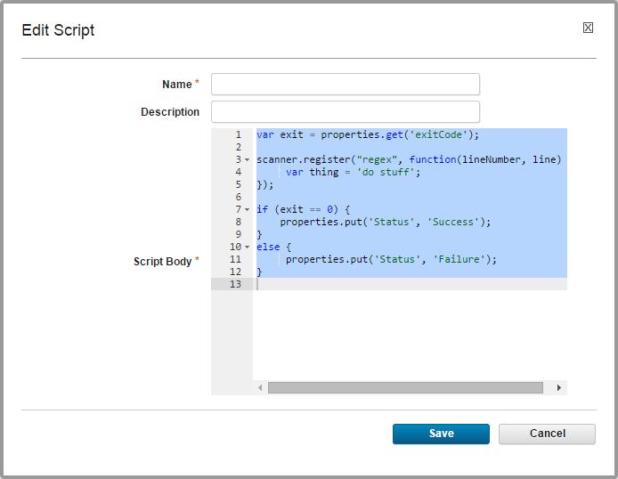

# Storing reusable post-processing scripts

You can store post-processing scripts on the server so you can reuse them in component processes and in generic processes.

When a step finishes, the agent runs the post-processing script for that step. When the agent runs the script, it first loads the server log file. It finds the exit code property of the target step with regular expressions that are defined in the script. It then applies any actions that are defined in the script before it runs the next step.

The HCL® UrbanCode™ Deploy server log file is normally found in the following location: server\_installation\_directory/var/log/deployserver.out.

1.   Click **Settings** \> **Post Processing Scripts** and then click **Create Script**. The Edit Script window opens, as shown in the following figure.

    

2.  Specify a name for the process step.
3.  Enter or paste the script into the **Script Body** field. See the roll-over help next to the field for information about the properties and variables that are available for user-defined scripts.

    Post-processing scripts must set the Status property to specify the status of the script. The script can specify any value for the Status property. For example, to specify that the script was a success, run the following command in the post-processing script:

    ```
    properties.put("Status","Success");
    ```


**Parent topic:** [Managing security](../../com.udeploy.admin.doc/topics/security_ch.md)

