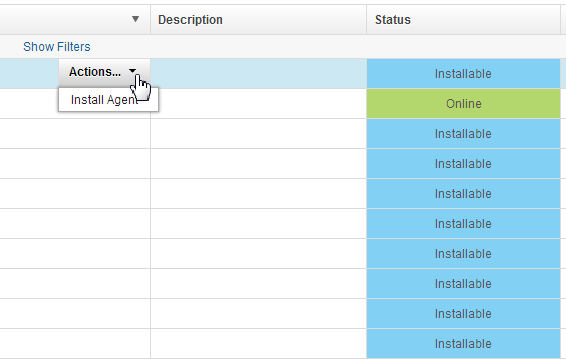

# Discovering agents automatically

You can use HCL® UrbanCode™ Deploy to discover potential agent locations on UNIX™ and Windows™.

Ensure that the Nmap utility is installed on the system where HCL UrbanCode Deploy server is installed, and that the Nmap utility is on the path environment variable.

This feature uses Nmap utility to search for locations where agents might be installed. The Nmap utility searches ports `22` and `135`. A location with port `22` that is open is assumed to be computer that is running UNIX. A location with port `135` that is open is assumed to be a computer that is running Windows.

**Note:** Agent discovery does not work on IBM® z/OS®.

1.  Click **Resources** \> **Agents**.
2.  Click **Discover Available Network Hosts**. 
3.  Using the Discover Available Network Hosts window, enter the subnets to search in the **Subnet** field. The format is `xxx.xxx.xxx.xxx/nn` where xxx.xxx.xxx.xxx is the IP address and nn is the network prefix. To search more than one subnet, enter each one on a separate line.
4.  Click **Save** to start the search. Search times depend on the size and number of subnets that are searched. If you search a large subnet, or many subnets simultaneously, the search time might be lengthy. Discovered locations are listed on the Agents tab with the status of Installable.

    

    A discovered agent is automatically given the same name as the discovered host. If the host name is unavailable, the discovered IP address is used instead.

You can install a discovered agent by using the **Install Agent** action that is associated with the agent on the Agents pane. For information about installing discovered agents, see [Installing agents remotely](agent_installremote.md#).

**Parent topic:** [Installing agents](../../com.udeploy.install.doc/topics/agent_install_ov.md)

