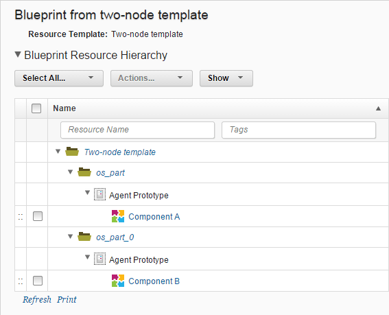

# Creating application blueprints

To create an application blueprint, map the components of the application to a resource template.

Create a resource template as described in [Creating resource templates](resources_templates_create.md#).

**Note:** To create blueprints for cloud systems, see [Modeling cloud environments with the blueprint designer](../../com.edt.doc/topics/blueprint_ov.md).

1.  Click **Applications**, click your application, and then click **Blueprints**.
2.   Click **Create Blueprint**. 
3.  Specify a name for the blueprint and select the resource template.
4.  Click **Save**.The new blueprint opens, showing the contents of the template, including the agent prototypes.
5.   Map the components of the application to the agent prototypes: 

    1.   Hover the mouse over an agent prototype and then click **Actions** \> **Add Component**. 
    2.   In the window that opens, select a component, specify its information, and click **Save**. 
    3.   Repeat this process to add the application components to the agent prototypes. Depending on how your application is organized, you can add the same component to multiple agent prototypes or multiple components to the same agent prototype.
    **Note:** If you create an environment from this blueprint and then add component mappings to the blueprint, the component mappings are also added to the environment. However, if you remove component mappings from the blueprint, the component mappings are not removed from the environment.

The complete application blueprint shows how the components are mapped to the agent prototypes. The following example shows a simple blueprint. The resource template contains two agent prototypes. In the blueprint, one component is mapped to each agent prototype.

Create environments that are based on this blueprint.

**Parent topic:** [Application blueprints](../topics/app_blueprint.md)

