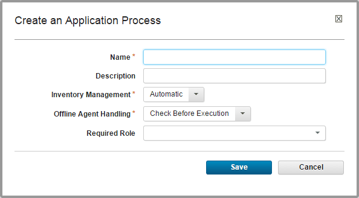

# Creating application processes

You can use application processes to deploy or to roll back components.

1.   Display the Create an Application Process dialog box \(**Applications** \> **select application** \> **Processes** \> **Create Process**\), and enter the following information: 

    

    |Field|Description|
    |-----|-----------|
    |**Name** and **Description**|Typically the name and description correspond to the application you plan on deploying.**Note:** You must specify a unique name. Your application process name cannot contain the same sequence of alphanumeric characters with different capitalization as an existing application process.

|
    |**Inventory Management**|If you want to handle inventory manually, select `Advanced`. To have inventory that is handled automatically, leave the default value, `Automatic`, selected. See [Inventories](inventory_ch.md).|
    |**Offline Agent Handling**|Specify how the process reacts if expected agents are offline:     -   **Check Before Execution**: checks to see whether expected agents are online before you start the process. If agents are offline, the process does not run.
    -   **Use All Available**; **Report Failure**: process runs while at least one agent is online; reports any failed deployments because of offline agents. Useful for rollbacks or configuration deployments.
    -   **Always Report Success**: process runs while at least one agent is online; reports successful deployments.
 |
    |**Required Role**|Use this list to select the role that a user must have to run the process. You will need to be in the required role for the team on the environment you are trying to run the process on. For more information, see [Roles and permissions](../../com.udeploy.admin.doc/topics/security_roles.md). The default value is `None`.|

2.  Save your work.

Edit the process in the process editor. See [Editing processes](comp_workflow_edit.md).

