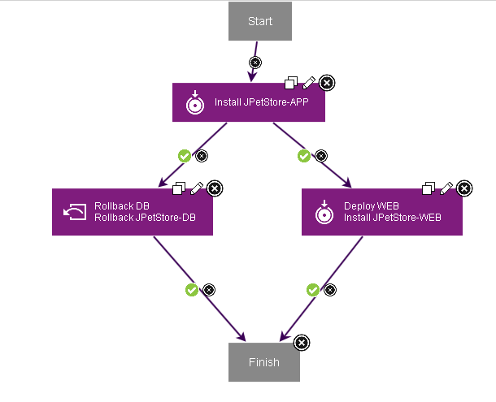

# Rolling back to a snapshot

You can roll back a component to the versions that are in a snapshot. In this case, you use a **Rollback Component** step with the **Remove Undesired Incremental Versions** option.

-   Create a snapshot that includes the component versions to be restored. Snapshots are typically made for every completed deployment, especially for deployments in critical environments. See [Creating snapshots](app_snapshot_create.md#).
-   Create an uninstall-type process for each component to be rolled back. For information about uninstalling component versions, see [Uninstalling components with an application process](app_process_deploy_uninstall.md#).

For a video demonstration of rolling back components, see [Rollback Scenarios in IBM UrbanCode™ Deploy](https://www.youtube.com/watch?v=8hH25vJ2f3E).

When you roll back to a snapshot in this way, the server runs the uninstall process for each component version that is not in the snapshot. The server runs the uninstall processes in the reverse order in which it deployed the versions, starting with the most recently deployed version and ending with the version that was deployed first. Only the versions in the snapshot are left on the environment.

This method is intended to uninstall incremental versions, but you can also use it to uninstall full versions. However, for full versions, in many cases, it is simpler to install the new full version over the existing full and incremental versions.

This method works best for component versions that are already deployed, regardless of whether the deployments of those versions were completed. As an alternative, you can add a step that immediately rolls back deployments of versions that were not completed; for that method, see [Rolling back components that fail to deploy](app_process_deploy_rollback_last.md).

1.  To roll back one or more components to the versions that are in a snapshot, complete these steps:
2.   Create an application process with a name such as "Roll back to snapshot." 
3.   In the application process, add one or more **Rollback Component** steps, one for each component to roll back. 
4.   In the properties for each **Rollback Component** step, specify values for the fields that follow. 

    **Tips:** 

    -   To specify these values, open the Edit Properties window by clicking the edit icon  after you drag the steps to the process flow diagram.
    -   All steps in the process must be connected in a flow from the process Start node to the Finish node. When you drag the first step to the process, the step is automatically connected to the Start and Finish nodes. When you drag another steps to the process, position the step between two steps so that the connection line is highlighted, and then drop the step. The step is automatically linked to the earlier and subsequent steps. If the connection line is not highlighted, you must manually make the connection from an earlier step to a subsequent step.
    -   ****Component****

        Specify the component to roll back.

    -   ****Component Process****

        Specify the uninstall process for the component.

    -   ****Rollback Type****

        Select **Remove Undesired Incremental Versions**.

5.   Verify that all steps in the process are connected in the order for them to run. To change the order of the steps, remove the links between steps by clicking the delete connection icon . Then, move the step into a new position and reconnect the steps in order. The following diagram shows a typical application process that includes a **Rollback Component** step. This application process is designed to roll back the three components in the application. Two components use an **Install Application** step that redeploys an earlier component version. The other component, the JPetStore-DB database component, uses a rollback step to roll back the incremental component version. This step uses the **Remove Undesired Incremental Versions** option and an uninstall-type component process.

    

6.   Run the application process, and specify the snapshot to roll back to. If you are rolling back by redeploying an existing version, be sure to clear the **Only Changed Versions** check box. Otherwise, the process does not redeploy the version.

The process uses the snapshot to determine which component versions to roll back. In each step that includes the **Remove Undesired Incremental Versions** option, versions that are not in the snapshot are removed.

