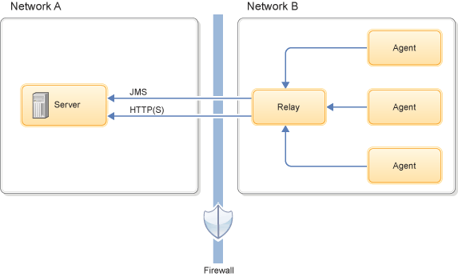
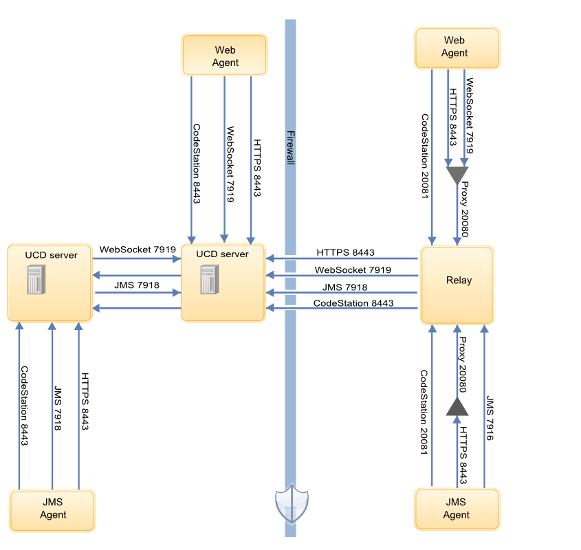

# Agent relays

Agent relays coordinate communication between agents and the HCL® UrbanCode™ Deploy server. Agent relays improve the performance of communication between the server and agents. Relays also allow agents to communicate through firewalls.

To enhance performance and reduce maintenance, HCL UrbanCode Deploy can use agent relays to communicate with remote agents. Instead of each agent connecting directly to the server, agents connect to agent relays, which then connect directly to the server. Using agent relays in this way reduces load on the server because the server has fewer direct connections.

Agent relays also simplify communication across networks and firewalls. If multiple agents are in a remote network without an agent relay, each agent must connect to the server individually. In this case, each agent must have network permission to connect to the server, including firewall permissions. With an agent relay, the agents connect only to the relay, and the relay is the only system that contacts the server directly, such as with a VPN or tunnel.

Agent relays are often convenient when the agents are on cloud systems, because cloud systems are often separated from the HCL UrbanCode Deploy server by a firewall or require a VPN or tunnel to reach the server.

The following figure is a simple diagram of communication between agents, an agent relay, and the server across a firewall. The agents connect directly to the agent relay, and the agent relay is the only system that connects to the server through the firewall.

The agent relay communicates with the server and the agents by using the same combination of JMS, HTTP, and HTTPS communication protocols that the agents use. As long as there is at least a low-bandwidth WAN connection between the server and agent relay, the HCL UrbanCode Deploy server can send work to agents in other locations.

Agent relays open the connections to the HCL UrbanCode Deploy server; the server never opens connections to the agent relays. Agents open the connections to the agent relay; the agent relay never opens connections to the agent. By default, agent relays open connections on the following ports for communication:

-   7918 for direct JMS connections to the server
-   8080 and 8443 for HTTP and HTTPS connections to the server

Agent relays accept connections on the following default ports:

-   7916 for JMS connections from agents
-   20080 For HTTP proxy connections from agents
-   20081 for artifact cache requests from agents

The server does not open connections to agents or agent relays.

The following diagram shows the main default ports that are involved in communication between agents, agent relays, and the server.

You can also cache artifacts on agent relays to improve system performance. See [Caching artifacts on agent relays](../../com.udeploy.install.doc/topics/t_agent_relay_cache_setup.md).

## Example

The following simple artifact move illustrates the mechanics of remote communications:

1.  A remote agent starts and establishes a connection to the agent relay through JMS
2.  The agent relay alerts the HCL UrbanCode Deploy server through JMS that the remote agent is online.
3.  The server sends an artifact download command to the relay through JMS, and the relay delivers the message to the remote agent, also through JMS.
4.  The server locates the artifacts. If the artifacts are not in the relay's CodeStation cache, the server sends the artifacts to the relay over HTTP or HTTPS.
5.  The agent relay streams the artifacts directly to the agent over the server-relay HTTP or HTTPS connection.
6.  After the remote agent completes the work, it informs the server through the agent relay JMS connection.

