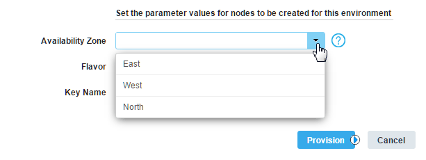

# Adding constraints to blueprint properties and parameters

You can add constraints to blueprint properties and parameters to limit the values for those properties and parameters.

You can add the following constraints to blueprint parameters. Each parameter can have any number of constraints.

-   The allowed\_values constraint limits the value to a list of predefined values.

    For example, the following parameter has a list of three valid values.

    ```
    availability_zone:
      type: string
      description: Name of availability zone in which to create the instance
      constraints:
        - allowed_values:
          - East
          - West
          - North
    ```

    When you specify valid values for a parameter in this way, the parameter appears as a drop-down list in the provisioning window, as shown in the following figure:

    

-   The length constraint limits the character length of the value.

    For example, the following parameter must be between 6 and 8 characters in length.

    ```
    image_name:
      type: string
      constraints:
        - length: { min: 6, max: 8 }
    ```

    When you provision an environment from the blueprint and specify a value outside the range, a warning appears, as shown in the following figure:

    

-   The allowed\_pattern constraint limits the value to a regular expression. For example, the following property is limited to begin with a capital letter, followed by at least one letter or number:

    ```
    image_name:
      type: string
      constraints:
        - allowed_pattern: "[A-Z]+[a-zA-Z0-9]"
    ```

-   The range constraint limits a numeric value to a range. For example, the following property is limited to a value between 2 and 64:

    ```
    memory_size:
      type: number
      default: 8
      constraints:
        - range: 
          min: 2
          max: 64
    ```


You can add these constraints directly to parameters, not to properties. To apply a constraint to a property, add the property to a resource as usual and use the get\_param function to retrieve a parameter value. Then, apply the constraint to the parameter.

**Parent topic:** [Blueprint properties, attributes, and parameters](../../com.udeploy.doc/topics/blueprint_props_ov.md)

