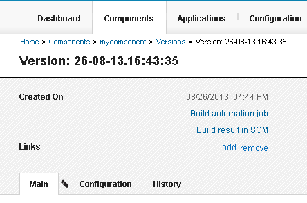

# Creating component versions with the command-line client

If HCL® UrbanCode™ Deploy does not have a source configuration type for your external tool, you can use the udclient command-line client to manage components.

To install the client, see [Installing the command-line client](../../com.udeploy.reference.doc/topics/cli_install.md).

When you use the udclient client in this way, you can push new versions of components to the server, start processes, add links to external sources, and run many other tasks on the HCL UrbanCode Deploy server as part of your build or SCM publishing process. In this way, you can work with your components in HCL UrbanCode Deploy without changing your current technology.

1.  Follow these general steps to set up a component that uses the command-line client:
2.   Create one or more components in HCL UrbanCode Deploy to represent the components of your build. Use the following parameters in the Create Component window: 

    -   In the **Source Configuration Type** field, select **None**.
    -   Clear the **Import Versions Automatically** check box.
    -   Complete the rest of the fields in the window as usual.
    You can also use the udclient client to create components, but because component creation is a one-time process, components are typically created withe the Web UI.

3.   In the scripts for your component, add code that calls udclient client commands to create a component version and upload the artifacts to the HCL UrbanCode Deploy server. In most cases, you use several different commands to create the version. The following steps show examples of some of the commands you might use.

    **Note:** These examples use code in an Apache Ant build file. Specifically, they call the udclient client with the Ant <exec\> command, which calls external programs. If you are using a different build or SCM technology, you can adapt the examples to your specific technology to call the udclient client.

    1.   Use the [createVersion](../../com.udeploy.api.doc/topics/udclient_createversion.md) command to create the new version. The following example code creates a version of a component that is named `mycomponent`. The version name is set to the timestamp of the build. The variables `${udclient.weburl}`, `${udclient.username}`, and `${udclient.password}` represent the URL of the server and the user name and password for the server.

        ```
        <exec executable="/bin/bash" 
          outputproperty="mycomponent.component.output">
        
          <arg value="/opt/udclient/udclient"/>
        
          <arg value="-weburl"/>
          <arg value="${udclient.weburl}"/>
        
          <arg value="-username"/>
          <arg value="${udclient.username}"/>
        
          <arg value="-password"/>
          <arg value="${udclient.password}"/>
        
          <arg value="createVersion"/>
        
          <arg value="-component"/>
          <arg value="mycomponent"/>
        
          <arg value="-name"/>
          <arg value="${buildTimestamp}"/>
        
        </exec>
        ```

    2.   Use the [addVersionFiles](../../com.udeploy.api.doc/topics/udclient_addversionfiles.md) command to upload the artifacts to the component version. The following example code uploads the files in the `${destdir}` folder to the version:

        ```
        <exec executable="/bin/bash">
        
          <arg value="/opt/udclient/udclient"/>
          
          <arg value="-weburl"/>
          <arg value="${udclient.weburl}"/>
          
          <arg value="-username"/>
          <arg value="${udclient.username}"/>
          
          <arg value="-password"/>
          <arg value="${udclient.password}"/>
          
          <arg value="addVersionFiles"/>
          
          <arg value="-component"/>
          <arg value="mycomponent"/>
          
          <arg value="-version"/>
          <arg value="${buildTimestamp}"/>
          
          <arg value="-base"/>
          <arg value="${destdir}"/>
          
        </exec>
        ```

    3.   Add links from the component version. With the [addVersionLink](../../com.udeploy.api.doc/topics/udclient_addversionlink.md) command, you can add links from the version to external build resources, such as the page that shows information about the build result. These links appear at the top of the information page for the component version. The following figure shows a component version with a link to the related build job and the related build result in the source-code management system:

        

        For example, the following code adds a link to the build result page at the URL `http://build.example.com/projects/mycomponent/${buildResultUUID}`:

        ```
        <exec executable="/bin/bash">
        
          <arg value="/opt/udclient/udclient"/>
          
          <arg value="-weburl"/>
          <arg value="${udclient.weburl}"/>
          
          <arg value="-username"/>
          <arg value="${udclient.username}"/>
          
          <arg value="-password"/>
          <arg value="${udclient.password}"/>
          
          <arg value="addVersionLink"/>
          
          <arg value="-component"/>
          <arg value="mycomponent"/>
          
          <arg value="-version"/>
          <arg value="${buildTimestamp}"/>
          
          <arg value="-linkName"/>
          <arg value="External build result"/>
          
          <arg value="-link"/>
          <arg value="http://build.example.com/projects/mycomponent/${buildResultUUID}"/>
          
        </exec>
        ```


Now, when you run a build in your external build tool, the build process creates a component version and uploads the artifacts for the version to the HCL UrbanCode Deploy server. From this point, you can work with the component and version on the server as usual, such as running processes with it.

You can also add other commands to your build script. For example, you can start application processes with the [requestApplicationProcess](../../com.udeploy.api.doc/topics/udclient_requestapplicationprocess.md) command.

**Parent topic:** [Creating components](../topics/comp_create.md)

