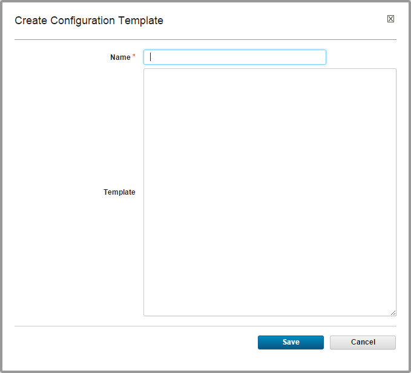

# Creating configuration files in component processes

Configuration templates are templates for files that are created during a component process. Typically, the data is for configurations for web servers, but the files can be used for any application that you deploy.

A configuration template contains property names and property references. For example, the following line can be used in a configuration template:

```
database.username=@DB_USER@
```

When you deploy the component in an environment, the value of the DB\_USER property that is defined for that environment is substituted for the `@DB_USER@` reference.

As an alternative to using configuration templates, you can also use the Create File step. In this case, you specify the contents of the file in the **Contents** field and include property references in the usual syntax of `${scope/propertyname}`, where `scope` is the scope of the property and `propertyname` is the name of the property.

1.  Click **Components** \> **selected\_component** \> **Configuration** \> **Configuration File Templates** \> **Create Configuration Template** to open the Create Configuration Template window. 

    

2.  Type a name in the **Name** field. 
3.  In the **Template** field, enter or paste the template text.Text can be in any script. The amount of text is based on the database that HCL® UrbanCode™ Deploy uses.
4.  Save the configuration template.
5.  To use the configuration template in a process, add the Install Template step to a component process: 
    1.  In a component process, add the Install Template step. This step creates a file that is based on the configuration template.
    2.  In the step properties, specify the name of the configuration template.
    3.  In the step properties, select the **Show Hidden Properties** check box.
    4.  In the **Environment Property List** field, specify the properties to bring into scope.For example, to bring only the environment properties into scope, specify `${p:environment/allProperties}`. In this case, the configuration template can refer to only environment properties. To bring environment properties, agent properties, and resource properties into scope, specify the following value for the **Environment Property List** field:

        ```
        ${p:environment/allProperties}, ${agent/allProperties}, ${resource/allProperties}
        ```

    5.  Save the step and the process

When you run the component process, the Install Template step creates a file that is based on the configuration template. The step replaces the property references with the property values. The default name of the file is the same as the name of the configuration template.

