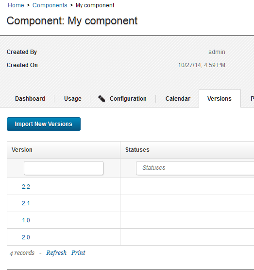

# Importing versions manually

If the component does not import new versions automatically, you can import versions manually.

To set up a component to import versions manually, see [Creating components](comp_create.md).

**Note:** Do not give component versions the name `latest`, `latestVersion`, or `newest`. These names are reserved to represent the most recently created version for certain CLI commands, including [requestApplicationProcess](../../com.udeploy.api.doc/topics/udclient_requestapplicationprocess.md) and [createSnapshot](../../com.udeploy.api.doc/topics/udclient_createsnapshot.md). You cannot use these keywords to represent component versions in the web interface.

1.   Display the Version pane for the component you want to use \(**Components** \> **selected component** \> **Versions**\). 

    

2.  Click **Import New Versions**.Depending on the source configuration type, you might see a window that prompts you for more information, such as the name of the version to import.

The new version or versions appear in the table of versions.

**Parent topic:** [Component versions](../topics/comp_version.md)

