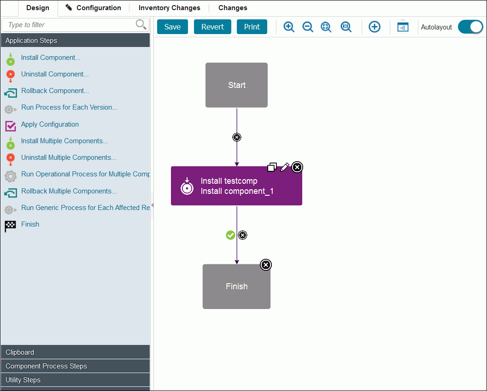
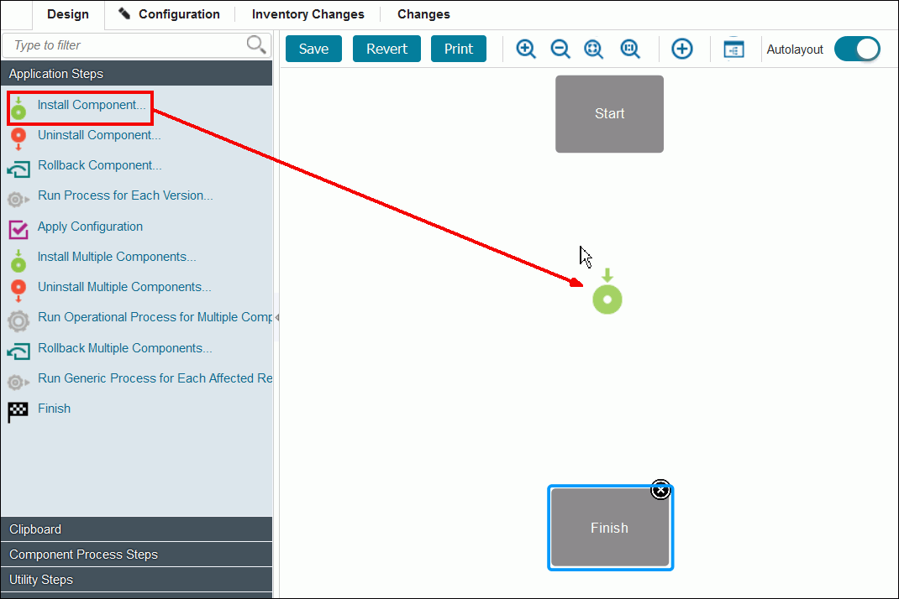
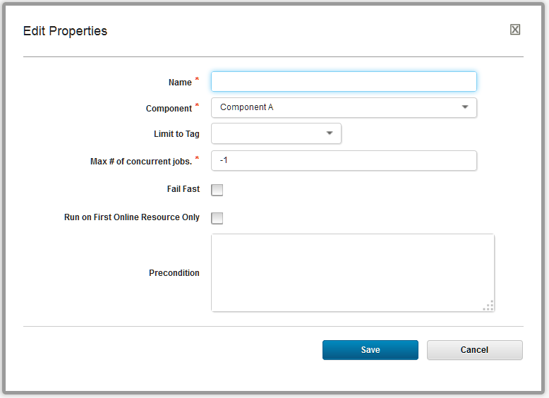
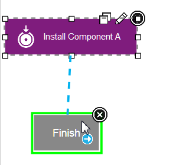
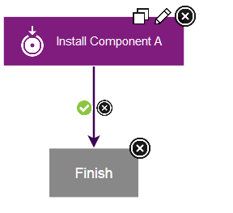

# Editing processes

In the process editor you organize the steps in a process, specify their properties, and connect them to each other.

1.   Open the component process in the process editor. 

    -   To open a component process, click **Components**, click the component, click the **Processes** tab for the component, and click the process.
    -   To open an application process, click **Applications**, click the **Processes** tab for the application, and click the process.
    -   To open a generic process, click **Processes**, and click the process.
    The process editor opens. The editor is similar for each type of process, but the list of available steps is different for each type of process.

    

    When the Process Design pane opens, the Design view is displayed. Processes are assembled with the Design view. Available steps are listed at the left of the window. HCL® UrbanCode™ Deploy provides several utility steps and plug-ins. More plug-ins and documentation for those plug-ins are available on IBM® developerWorks®: [UrbanCode Deploy Plug-ins](https://developer.ibm.com/urbancode/plugins/ibm-urbancode-deploy).

    In addition to the process editor, the following two pages provide information about the process:

    -   The **Configuration** page shows the properties and settings for the process.
    -   The **Changes** page shows a record of every change to the process, addition or deletion of a property, and save or deletion of the process.
2.   To add a step: 

    1.   From the list of steps at the left of the window, drag the step to use onto the design space. 

        

        To open the Edit Properties window, click the edit properties icon . When you drag the first property on the design pane, you can place the step anywhere on the design space. Connection links are automatically created from the Start node to the step and from the step to the Finish node. When you add more steps, drag them and position them so that they highlight the connection link between stesps so that the step is inserted and connection links are automatically created between the steps. Steps can be dragged and positioned at any time. However, you must delete the connection links from the step by clicking the delete connection icon , and then reconnect the moved steps.

        

        Configuration dialogs boxes are tailored to the selected step. Only parameters that are associated with the step type are displayed.

    2.   Specify the properties for the step. Each step has different properties. See [Plug-ins](../../com.udeploy.reference.doc/topics/plugin_ch.md) for information about configuring specific steps.
    3.   To add or change the post-processing script, select a script in the **Post Processing Script** list. For more information, see [Post-processing scripts](comp_postProcess.md).
    4.   After you configure the step properties, save the step by clicking **Save**. 
    The step is in the design space and is connected to other steps. If you change your mind, click **Cancel** to remove the step from the design space.

3.   Verify that the step connections create the required process flow: Connections control the process flow. The originating step runs before the target step. If you move steps or do not highlight a connection link when you place a step, creating a connection between steps is a simple process. You drag a connection from the originating step to the target step. Connections are typically formed automatically. However when you create them manually, connections are formed one at a time between two steps, the originating step and the target step. To create connections manually:

    1.   Hover the cursor over the step to use as the origin of the connection. The connection tool is displayed.

        

    2.   Drag the connection tool over the target step. The step beneath the connection tool is highlighted.

        

    3.   Release the connection tool over the target step to complete the connection. 
    

    Each connection has a connection delete tool, conditional flag, and might have other tools depending on the originating step. Remove a connection by clicking the delete tool.

4.  Add more steps to the process, connect them, and arrange them in the process editor.You can drag steps to move them around the process. In this way, you can arrange the steps in a meaningful arrangement on the process editor canvas.

    **Tip:** To move more than one step at a time, hold the Ctrl or Command key and click two or more steps to select them. Then, drag the steps to a different place in the editor.

5.   Verify that the flow of steps is correct. Each process starts with the Start step and continues until it reaches the Finish step. Therefore, the Start step must connect to the first step or steps to run. Similarly, the last steps must connect to the Finish step, or else the process does not finish correctly.
6.   When you are finished with your work on the process, click **Save**. If comments are required, the Process Change Comment window opens. Type a comment, and then click **Save**. The server settings control whether comments are required. To learn more about system settings, see [Server settings and configuration](settings_ch.md).

**Parent topic:** [Processes](../topics/comp_workflow.md)

