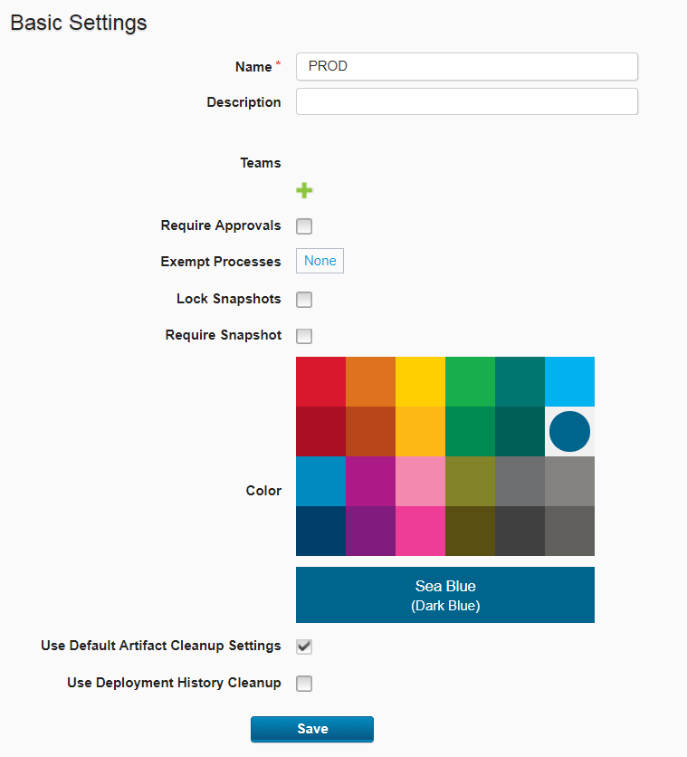
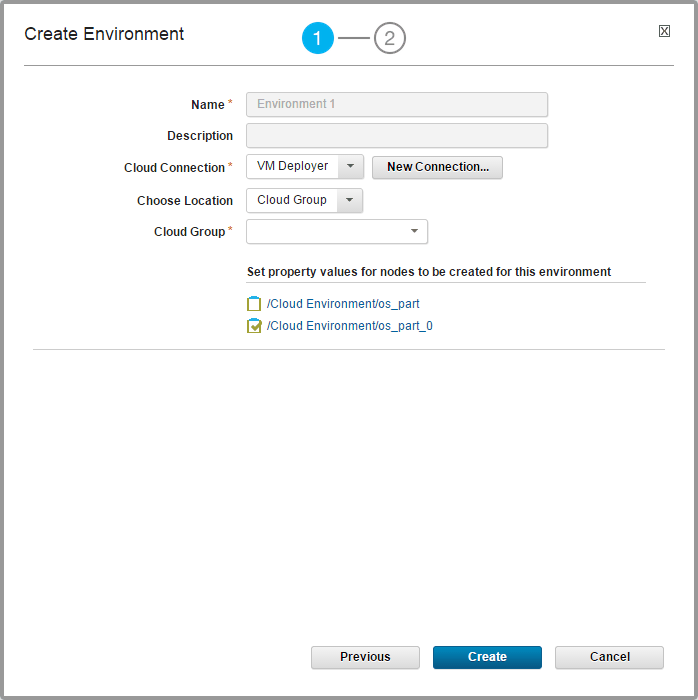

# Provisioning environments through the server \(through virtual system patterns\)

You can provision environments on a cloud system as part of creating an application environment on the HCL® UrbanCode™ Deploy server.

This method works for blueprints that were created on the server to provision environments on virtual system pattern-based clouds.

-   Connect to a cloud system and create blueprints for that cloud. See [Connecting to clouds through HCL UrbanCode Deploy](cloud_integrate_vsp_ov.md).
-   Ensure that you have at least one base resource to associate with the new environment. See [Resources](resources_ch.md).

1.   Click **Applications**, click your application's name, and click **Create Environment**. The Create Environment dialog box opens, as shown in the following figure:

    

2.   Specify the environment name. The name is used as part of the deployment process and typically corresponds to the target environment. If you deploy to an integration environment, you might name the environment `SIT`.

    **Restriction:** If you provision this environment to a cloud that uses virtual system patterns, the environment name cannot contain asterisk \(\*\), backslash \(\\\), or forward slash \(/\) characters. See [Modeling environments for clouds that use virtual system patterns](../../com.edt.doc/topics/blueprint_edit_clouds_vsp.md#).

3.   Provide the following information: 
    1.   Specify a description. 
    2.   If you created the application from an application template, in the **Environment Template** list, select the environment template to use for the environment. You can assign any security type to this environment.
    3.   In the **Blueprint** list, select the blueprint to use for the environment. 
    4.   Next to **Base Resource** click **Set**, select an agent from the Select Resource dialog box, and then click **OK**. This field appears only if you are using a blueprint that is managed on the HCL UrbanCode Deploy server. It does not appear for blueprints that are managed on the blueprint designer.
    5.   To grant teams access to the environment and set its security type, click the **plus sign** icon by **Teams**, select values from the **Team** and **Type** lists, and click **Add**. 
    6.   To ensure that components cannot be deployed to the environment without first being approved, select the **Require Approvals** check box. If selected, HCL UrbanCode Deploy enforces an approval process before the deployment can be deployed to the environment. Initial deployments are typically done in uncontrolled environments. After the deployment works as designed, you can configure an approval process as the application moves along the development pipeline. If you are setting up more than one environment, consider creating an approval process for at least one of them. 
    7.   To prohibit the user who makes an approval request from approving the same request, select **No Self-Approvals**. 
    8.   To exempt processes from approvals, click **None** by **Exempt Processes**, select the check boxes beside the application processes to exempt, and click **OK**. 
    9.   To prevent changes to snapshots in this environment after you deploy them, select the **Lock Snapshots** check box. 
    10.  If you selected the **Lock Snapshots** check box, from the **Snapshot Lock Type** list, select the lock type: 
        -   To lock only component versions, select **Only Component Versions**.
        -   To lock snapshot configurations, select **Only Configuration**.
        -   To lock both component versions and configurations, select **Component Versions and Configuration**.
        -   To use the system default value, select **System Default**. The default value is determined by the **Default Snapshot Lock Type** field on the System Settings page. For information about system settings, see [Server settings](../../com.udeploy.admin.doc/topics/settings_system.md#).
    11.  Select **Require Snapshot** to require that snapshots are deployed to the environment. When this option is selected, only snapshots can be deployed to the environment.
    12.  Select a color to apply to the environment. 
    13.  To apply the component version and snapshot cleanup settings that are specified on the System Settings page, select the **Use Default Artifact Cleanup Settings** check box. If this check box is cleared, you must specify how long to keep snapshots and component versions. For more information about cleaning up snapshots, see [Cleaning up snapshots](app_snapshot_cleanup.md). For more information about cleaning up component versions, see [Cleaning up component versions](settings_system_preview.md). 
    14.  To use deployment history cleanup, select **Use Deloyment History Retention**. You can use the default settings that are specified on the Systems Settings page by clicking **Use Default Deployment History Retention**, or in **Days to Retain Deployment History** you can specify a number of days to retain deployment history records.
4.   Click **Next**. On the next page, you can customize the properties for each virtual node in the resource request, such as starting user names and passwords. 
5.   On this page, specify the following information about the cloud resource request: 
    1.   In the **Cloud Connection** field, make sure that the connection to your cloud system is listed. This list shows connections that you have access to, based on the security settings for those connections. This list shows only connections to clouds that use virtual system patterns; to provision environments on clouds through OpenStack Heat, see [Provisioning environments from the blueprint designer \(through OpenStack Heat\)](../../com.edt.doc/topics/env_provision_edt.md). 
    2.   In the **Choose Location** field, specify where to store the virtual nodes and how to allocate IP addresses to those nodes. Select **Cloud Group** to store the virtual nodes on one of the hypervisors in a cloud group. Select **Environment Profile** to provision the virtual nodes according to an environment profile. For more information about cloud groups and environment profiles, see the documentation for your cloud system. 

        **Note:** If you have to specify both the environment profile and the IP group, first specify the environment profile on this page. Then, on the properties page for each node, specify the IP group for each node.

        **Restrictions:** 

        -   For IBM PureApplication® System, you must use an environment profile; cloud groups are not supported.
        -   To provision resources with the **Use VSys.Next patterns** option, you must select an environment profile; you cannot use a cloud group.
    3.  If you selected **Cloud Group**, select a cloud group in the **Cloud Group** field. 
    4.  If you selected **Environment Profile**, select an environment profile in the **Environment Profile** field. 
    5.  Under **Set property values for nodes to be created for this environment**, you can customize the properties for the request. To customize these properties, click the node. A window opens that shows the properties for the node, including virtual image properties such as memory, number of processors, and starting passwords. The window also shows the properties for each script package on the node. 

        **Note:** In some cases, you must specify certain properties before you can submit the request. In this case, when you click **Save**, a dialog box lists the required properties that are not specified.

6.   Click **Create** to submit the request. 

The new environment is displayed in the **Environments** pane and the server submits the cloud resource request. When the cloud resources are ready, the agents contact the server and are added to the environment. You can see the cloud resources by opening the console for your cloud system.

**Parent topic:** [Provisioning cloud environments](../../com.edt.doc/topics/env_provision_ov.md)

**Parent topic:** [Overview of integrations](../topics/integrat_ov.md)

