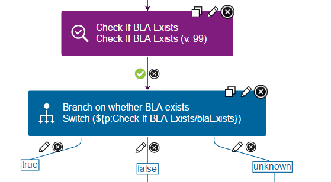

# Output properties

Output properties are specialized properties that process steps generate. You use output properties to pass parameters to subsequent steps in a process.

You can use output properties in component processes and generic processes.

In the JavaScript™ code for your postprocessing steps, you can establish output properties. See [Examples of post-processing scripts](comp_postprocess_examples.md#). You set an output property for a step by assigning it a name and a value in the postprocessing script. For example, the following code from the Check If BLA Exists step in the IBM® WebSphere® Application Server, Deployment plug-in establishes three possible values for the `blaExists` output property:

```

def exitCodeChecker = { exitCode ->
    if (exitCode == 0) {
        properties.setProperty("blaExists", "true");
        exitValue = 0;
    }
    else if (exitCode == 30) {
        properties.setProperty("blaExists", "false");
        exitValue = 0;
    }
    else {
        properties.setProperty("blaExists", "unknown");
        exitValue = 1;
    }

```

In the same way, you can create your own output properties by adding them in post-processing scripts. Use the format `properties.setProperty("propName",propValue);`, where `propName` is the name of the property and `propName` is the value of the property. For example:

```
properties.setProperty("url", "http://example.com");
```

Then, you can refer to these output properties in other steps in a process. To do so, you must know the name of the step that contains the output property that you use. For example, your process might require different actions if a BLA exists. In this case, you could use a Switch step to branch the process for each case. In the following figure, the Switch step checks the value o f the `blaExists` output property by using the code `${p:Check If BLA Exists/blaExists}`:



You can use output properties in other postprocessing scripts, step preconditions, step properties, or the code of steps themselves. Passing property values among processes, resources, and steps helps limit the requirement to provide input manually and to maintain accuracy and reliability.

**Parent topic:** [Properties](../topics/ud_properties_overview.md)

