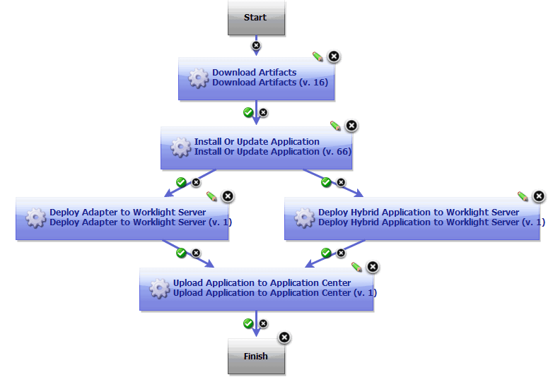

# Deploying mobile applications

You can use the process steps in the IBM® MobileFirst Platform Foundation \(formerly Worklight®\) plug-in to deploy mobile applications to MobileFirst Platform Foundation Server.

-   If it is not already installed, install the MobileFirst Platform Foundation plug-in. For more information about installing this plug-in, see [Installing plug-ins](../../com.udeploy.admin.doc/topics/settings_plugins.md).
-   Install the plug-in that corresponds to the application server that is running the MobileFirst Platform Foundation Server. You use this plug-in to deploy the WAR file to the MobileFirst Platform Foundation Server. For example, install one of the following plug-ins:
    -   Apache Tomcat
    -   IBM WebSphere® Application Server
    -   IBM WebSphere Application Server Liberty Profile
-   Verify that your process steps use the path to the JAR files that correspond to your MobileFirst Platform Foundation Server version. For example, if you are using MobileFirst Platform Foundation plug-in Version 2.0 or later and a version of MobileFirst Platform Foundation Server later than 6.0, you must update your process steps.

    **Tip:** The following JAR files are available for use from MobileFirst Platform Foundation plug-in Version 2.0 or later:

    -   **worklight-ant.jar**

        Used to deploy artifacts to the IBM® Worklight® Server Version 6.0.

    -   **worklight-ant-deployer.jar**

        Used to deploy artifacts to the IBM® Worklight® Server Version 6.1 or later.

    -   **applicationcenterdeploytool.jar**

        Used to interact with an Application Center installed on an IBM® Worklight® Server version 6.0 or later.

    -   **json4j.jar**

        Used with the IBM® Worklight® Server Version 6.0 or later.

In the process editor, you can modify component processes to include steps to deploy the following mobile application artifacts to your MobileFirst Platform Foundation Server:

-   Native applications \(Android .apk or iOS .ipa MobileFirst Platform Foundation Adapters \(.adapter\)
-   MobileFirst Platform Foundation Applications \(.wlapp\)
-   MobileFirst Platform Foundation project \(.war\)

The following sequence is a suggested order for deploying the mobile application artifacts:

1.  Deploy the .war file to the application server by using a process step from the corresponding plug-in for the type of application server that is running the MobileFirst Platform Foundation Server.
2.  The following artifacts can be deployed in parallel or in either order:

    -   Deploy the MobileFirst Platform Foundation Adapter \(.adapter\) file to the MobileFirst Platform Foundation Server Console by using the Deploy Adapter to Worklight Server step.
    -   Deploy the MobileFirst Platform Foundation Application \(.wlapp\) file to the MobileFirst Platform Foundation Server Console by using the Deploy Worklight Application to Worklight Server step.
    For more information about the steps in the MobileFirst Platform Foundation plug-in, see [MobileFirst Platform Foundation plug-in - documentation](https://developer.ibm.com/urbancode/plugindoc/ibmucd/worklight-plug/1-2/).

3.  Deploy the Android application package \(.apk\) or iOS application \(.ipa\) file to the Application Center by using the Upload Application to Application Center step.

The following simple example process deploys a mobile application to the MobileFirst Platform Foundation Server Console and Application Center.

1.  The Download Artifacts step retrieves the binary files.
2.  The Install or Update Application step deploys the .war file to WebSphere Application Server \(the application server that is used in this example\).

    **Note:** The Install or Update Application step in this example is provided by the WebSphere Application Server - Deploy plug-in \(not the MobileFirst Platform Foundation plug-in\).

3.  In parallel, the .adapter and .wlapp files are deployed to the MobileFirst Platform Foundation Server Console by the Deploy Adapter to Worklight Server step and the Deploy Worklight Application to Worklight Server step.
4.  The .apk \(Android\) or .ipa \(iOS\) file is deployed to the Application Center by the Upload Native Application to the Application Center step.

**Parent topic:** [Building and deploying mobile applications](../topics/plugins_worklight_buildanddeploy.md)

