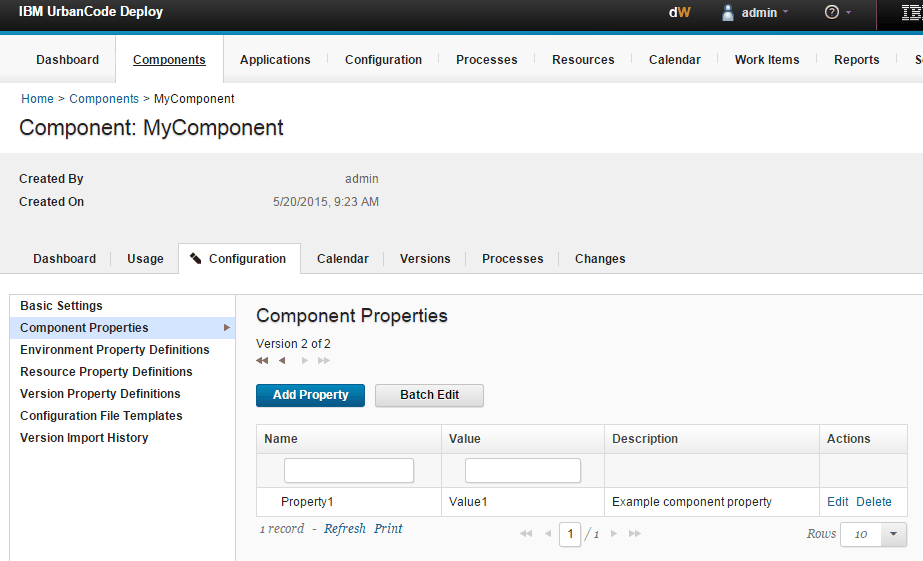
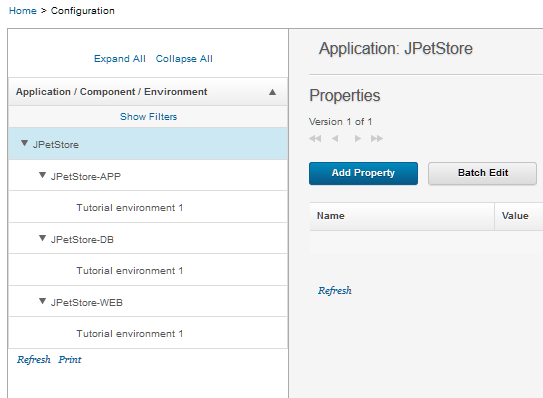
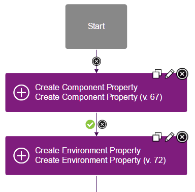

# Creating, setting, and editing properties

Properties can be created for most elements, including components, resources, applications, and agents. You can set and change properties in many different ways.

A property represents a user-defined parameter. Properties are typically accessed in processes. For information about using properties, see [Referring to properties](ud_properties_using.md).

-   **[Retrieving property values from external files](../topics/props_from_http.md)**  
You can specify that a property takes a value from an XML or JSON file over HTTP. Then, when you run the process, the server prompts you with a list of values from that file.
-   **[Passing properties from blueprints to the resource tree](../topics/env_props_BDS.md)**  
From the blueprint designer, you can set component environment properties and component resource properties in blueprint source code.

**Parent topic:** [Properties](../topics/ud_properties_overview.md)

## Setting properties manually

You can create and edit properties on many elements by opening the element and going to its **Configuration** tab.

To edit most of the properties for an element, open the element, go to its **Configuration** tab \(not the **Configuration** tab at the top of the page\), and then click **element\_type Properties**. For example, to edit component properties, click the component, click **Configuration**, and then click **Component Properties**, as shown in the following figure.



However, if you created an application from a template, any environment or application properties that you specified are not available on the **Configuration** tabs. You can view and edit, but not delete, these properties by clicking the element's **Configuration** tab \(not the **Configuration** tab at the top of the page\), and then clicking **Basic Settings**.

To add a property, click **Add Property**, and provide the information about the property, including its name, value, and description. You can also edit multiple properties at once by clicking **Batch Edit**. Then, in batch mode, specify the properties in name-value pairs that are separated by line breaks, as in the following example:

```
Property1=Value1
Property2=Value2
Property3=Value3
```

Escape backslash, equals, and colon characters \(`\`, `=`, `:`\) with a backslash, for example:

```
WindowsPath=C\:\\myfolder\\myfile.txt
PropertyWithColons=This string\: has a colon
```

To create a property, put the new property and its value on a new line. To include a line break in a property value, use "`\n`". Be sure to click **Save** to save your changes when you are finished editing multiple properties. To close batch edit mode, use the **Use Table** command. Secured values are encrypted when they are displayed in batch mode. If you modify an encrypted value, the modifications are encrypted when you exit edit mode.

## Setting properties with the **Configuration** tab

On the top-level Configuration page you can directly manage properties for applications, components, and environments.

Access the Configuration page by clicking the **Configuration** tab. From this page, you can add properties to applications, components, and environments.



## Setting properties in processes

Several different steps are available to create and set properties in processes.

For example, the [IBM UrbanCode Deploy Components](https://developer.ibm.com/urbancode/plugin/ibm-urbancode-deploy-components/) plug-in contains the Create Component Property step. This step creates a component property or changes the value of an existing component property.



**Note:** If you use these steps to change the value of a property, the new property value is not available until the next process runs. Later steps in the same process use the same value that the property had when the process started.

## Setting properties with the REST API and command-line client

Several commands in the REST API and in the command-line client can set properties. See [REST API reference](../../com.udeploy.reference.doc/topics/rest_api_ref_overview.md) and [Command-line client \(CLI\) reference](../../com.udeploy.reference.doc/topics/cli_ch.md).

## Setting output properties

To pass properties from one step to another within a process, you can use output properties. See [Output properties](output_properties.md).

## Passing properties from blueprints to the resource tree

You can pass properties from blueprints to the server. See [Passing properties from blueprints to the resource tree](env_props_BDS.md).

## Setting properties from external files

You can retrieve property values from an external file. See [Retrieving property values from external files](props_from_http.md).

