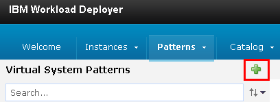
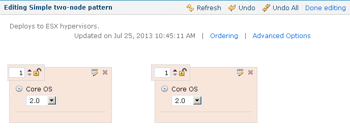

# Creating virtual system patterns for resource templates

To provision dynamic environments from a cloud system, you must create a virtual system pattern that specifies the contents of the environment.

-   Make sure that you have a user account on the cloud and that you have the permission to create virtual system patterns.

    For this type of cloud integration, the following cloud systems are supported:

    -   IBM® Cloud Orchestrator version 2.4 or later
    -   IBM SmartCloud® Orchestrator versions 2.2 and 2.3
    -   IBM PureApplication® System version 1.0 or later
    -   IBM Workload Deployer version 3.1.0.6 or later
    Within these cloud systems, you can provision the virtual resources in environment profiles or in cloud groups. You can also assign the virtual resources to IP groups, but only when you assign the resources to an environment profile first. For more information, see [Creating environments](app_environment_create.md). You can also use virtual images with no more than one virtual network card. HCL® UrbanCode™ Deploy does not support selecting different flavors of virtual resources or virtual nodes that have a multiplicity greater than 1.

-   Configure the cloud system as described in [Configuring virtual system pattern-based clouds](../../com.udeploy.install.doc/topics/cloud_configure.md).

The virtual system pattern specifies one or more virtual images. The pattern also lists the script packages to apply to the virtual images. These scripts perform tasks such as opening the firewall and installing the HCL UrbanCode Deploy agent.

1.  On the web console for the cloud host, create a new virtual system pattern.This process differs depending on the type of cloud. For instructions, read the documentation for your cloud system. For example, for IBM Workload Deployer, click **Patterns** \> **Virtual Systems** and then click the **New**  button.

    

2.  Give the pattern a name and click **OK**. 
3.  Click **Edit**.
4.  In the **Parts** list, find one or more base virtual images for the application.

    **Note:** These virtual images must have the following characteristics:

    -   An installation of Java™
    -   The unzip program
    -   The JAVA\_HOME system variable set
    If the image does not have one or more of these prerequisites, you can add them later with script packages or select an appropriate image.

    **Restriction:** For versions of HCL UrbanCode Deploy prior to version 6.0.1.4, the image must not have more than one network card. For version 6.0.1.4 and later, the image can have more than one network card.

5.  Drag one or more copies of the base images to the editor. For example, the following figure shows a pattern that contains two images. 

 
6.  Add script packages to the nodes based on the requirements of your cloud system.For example, you might need to open the firewall on the images. You might also need to run script packages for security compliance or registration. To add a script package, find it in the Pattern Editor, under **Scripts** and then drag the script package to one node at a time.
7.  Add the Install HCL UrbanCode Deploy Agent script package to each node.You do not need to specify the parameters on this script package; these parameters are filled in when you provision an environment using this pattern.
8.  Customize the pattern.For example, you can specify the passwords for the images by clicking the **Properties**  icon at the top of each image. Depending on the images you are using, you might be able to specify the memory or processing power of the images, or other details about the images.
9.  Click **Done editing** to save the pattern. 

Now you can import this pattern to a resource template. See [Importing resource templates from clouds](resources_template_import_cloud.md)

