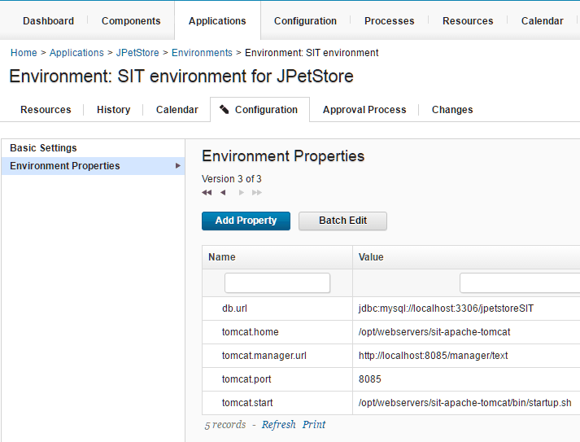
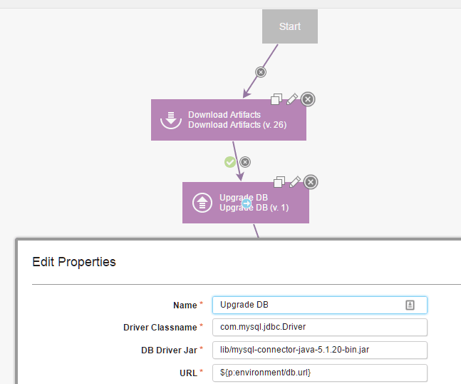
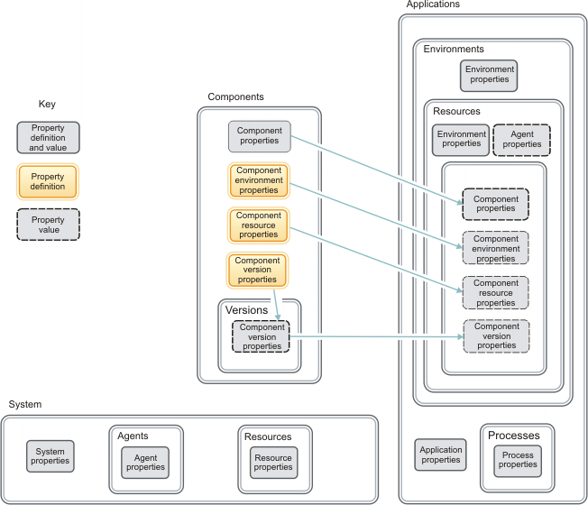

# Properties

Properties are variables that store information about many different elements, including components, environments, processes, and applications. You can also set global properties for the system.

Common uses of properties are to store the locations of files, folders, servers, tools, or other resources that might change. For example, the application in the tutorial [Deploying a simple web application](../../com.udeploy.tutorial.doc/topics/webapp_abstract.md) uses properties to store the location of a web server and a database. In the tutorial, you set the location of a database in an environment property that is named `db.url`. Then, any time that you want to refer to the location of the database, such as when you configure an application to store data in that database, you can use the property value `${p:environment/db.url}`. If you need to change the location of the database, you only need to change the property value, and all references of the property now point to the new location.

In this case, you set the property by opening the environment, clicking its **Configuration** tab, and then clicking **Environment Properties**, as shown in the following figure. Components, applications, and processes have equivalent properties tabs.

You can then refer to the properties in processes. For example, the following step is in a component process that accesses the database. In one of the step parameters, the value `${p:environment/db.url}` represents the database location.

Properties have scope, which limits where they can be accessed and which properties take precedence over others with the same name. For example, environment properties can be accessed from within the environment, including from components and applications that are deployed to that environment. For more information on property scope, see [Property contexts](ud_properties_context.md).

The following diagram shows some of the major properties that are available and where they can be set and accessed.

-   The box at the bottom of the diagram represents the properties that you can set at the system level or the resource tree level. These properties include system properties, which are available in all contexts. The server also stores properties on agents and resources, and these properties are available in all contexts in which these agents and resources are used.
-   The box at the center of the diagram represents the properties that you can set on components. Components have component properties, but components also have several types of properties that are specified in a way that is different from other properties. These properties are defined on the component, but their values are set in other places:
    -   **Component environment properties**

        Component environment properties are defined on components, but they are not given a value until the component is deployed to an environment. Then, the property behaves much like an environment property; it is available within the scope of the environment.

    -   **Component resource properties**

        Component resource properties are defined on components, but they are not given a value until the component is added to an environment as a resource. Then, the property behaves much like a resource property. Because a component can be added to an environment multiple times, each instance of the component can have a different value for the component resource property.

    -   **Component version properties**

        Component version properties are defined on components, but they are not given a value until you import a component version. Thus, each component version has a different value for the component version property. When you deploy the component to an environment, the component version property behaves much like an ordinary component property.

The boxes at right show which properties are defined in applications and environments, and which properties are accessible in applications and environments. Applications, environments, and the processes and resources in those applications and environments can all have properties. Also, with environments, you can access the properties of components that are deployed to those environments.

You set properties on these HCL UrbanCode Deploy elements to achieve four primary goals:

-   [Providing information that varies in different contexts](#environments)
-   [Storing secure information](#store_secure)
-   [Providing property values to other processes, resources, and steps](#pass_on_props)
-   [Setting system variables](#system_props)

## Providing information that varies in different contexts

Environments are configured differently, which can make automating deployments difficult. With properties, however, you can provide the correct information to each set of components in each environment.

An application might be deployed to several target environments. Each of these environments might be configured differently; for example, tools and resources might be in different directories, or the application must use different ports depending on the environment. Environment properties provide information about those different environments. For example, an environment property can map to different ports as required by the target computers for applications that run on different ports and that communicate with different databases.

As described in [Property contexts](ud_properties_context.md), you can also use properties to override defaults in certain areas.

## Storing secure information

To deploy applications, installing components on a target computer might require IDs and passwords that must remain secure. The user interface might display this information, and testing and debugging might require log reviews. In this case, use secure properties to store the passwords. These properties can contain the ID and password information, but they display in the user interface and in logs as asterisks \(\*\).

## Providing property values to other processes, resources, and steps

In complex processes and deployment scenarios, you want to automate as much as possible. Passing property values among processes, resources, and steps helps to limit the requirement to provide input manually and to maintain accuracy and reliability. For example, you can refer to output properties from one step in another step. See [Output properties](output_properties.md).

## Setting system variables

Properties are flexible, and you can apply them to processes, environments, components, and even the system. However, keeping track of what properties are set where and on what element can present a challenge. One way to meet that challenge is to set system properties that apply to all situations. Of course, you must be judicious in setting system properties so that you can be flexible in applying properties to other elements. When you want to define a property one time and have it apply to all situations, the system property reduces set up time.

Assume that you have one Maven repository for all your code. You might refer to the address for this repository many times in many different applications. You don't need to set the address for this repository more than once. You set a system property, for example: `maven.repository.url=/theURL/`. In most places in a deployment process, use this property in place of the actual address. If the address of the Maven repository changes, you can universally change all references by changing the system property.

