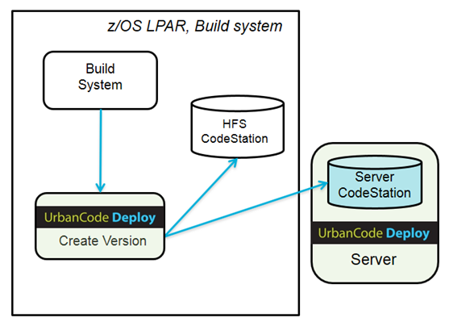

# Choosing a CodeStation and planning storage

After installation, you can change the CodeStation where version artifacts are stored. The IBM z/OS agent that is used to import version stores artifact versions when the choice of CodeStation is HFS. Every z/OS agent that is used to deploy projects stores backups of old artifacts so that a rollback can be done when required. Plan the agent directory to ensure there is sufficient space for CodeStation and backup.

## Choosing a CodeStation

When you deploy IBM z/OS artifacts by using z/OS components, you can select one of two CodeStation choices to store version artifacts. The agent installer prompts you for the choice and setup accordingly. You can modify the setting in the installed.properties file after installation.

-   

-    You can select the default CodeStation type: Server Codestation. 

    The server CodeStation is part of the HCL® UrbanCode™ Deploy server. It is the CodeStation for all Windows, UNIX and Linux artifacts. It is the default CodeStation for z/OS artifacts.

    Artifacts in Server CodeStation can be downloaded to any deployment targets using secured connections and using the same process step.

-    If you want to keep z/OS artifacts in the z/OS file system, use the HFS CodeStation. 

    The HFS CodeStation is provided to users who want to keep z/OS artifacts on the z/OS file system. A z/OS HFS directory is used to store the version artifacts. A copy or FTP step must used to transfer the artifacts to the target LPAR for deployment.

    The default location of the codestation is agent install dir/var/repository. You can use symbolic links to link it to another directory.

## Planning storage

The z/OS agent that imports versions stores those artifact versions when the choice of CodeStation is HFS. Every z/OS agent that deploys projects stores backups of old artifacts so you can roll back to a previous version.

-    Plan the agent directory to ensure there is sufficient space for the artifact versions in the CodeStation and backups. The space requirements vary depending on retention policies, application types, number of artifacts, and the number of deployments. For typical production environments, allocate 10 - 20 GB for storing version artifacts and for storing deployment backups. A breakdown estimation follows: 
    -   **Agent installation directory**: The agent install directory requires at least 500 MB space.
    -   **HFS CodeStation directory**: The default location of the HFS CodeStation is agent install dir/var/repository. Estimate storage requirements by multiplying the average artifact size by the number of versions that are imported per day, and then multiply the preceding result by the average number of days before cleanup. Add 20 percent to account for metadata.
    -   **Deploy backup directory**: The location of the deploy backup is agent install dir/var/deploy. Estimate storage requirements by multiplying the average artifact size by the number of deployments that are performed per day, then multiply the preceding result by the average number of days before cleanup.
    -   **MVS data sets**: MVS data sets are used to store z/OS agent binary, configuration, samples and JCLs only. No additional space is needed in addition to the space that is allocated by the installation.

