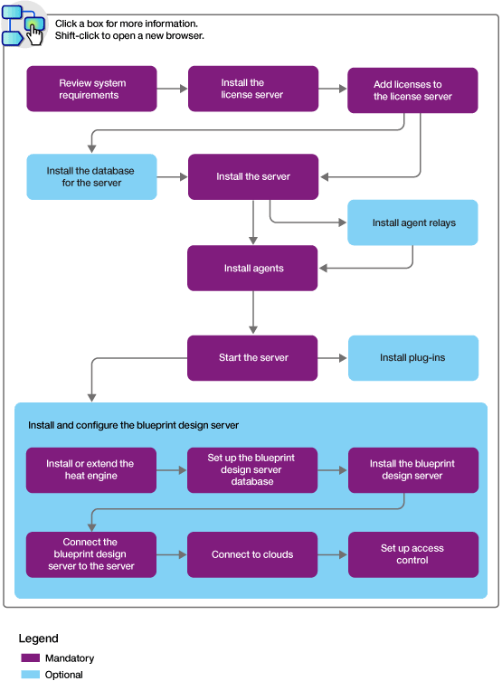

# Installing HCL UrbanCode Deploy

An HCL® UrbanCode™ Deploy installation consists of the HCL UrbanCode Deploy server, a database, and at least one agent. The installation can include the blueprint design server and its engine and database.

Typically, the server, database, agents, engine, and blueprint design server are installed on separate systems, although for a simple evaluation they can all be installed on the same system.

Installing HCL UrbanCode Deploy usually involves the following general steps:

1.  Review the system requirements. See [System requirements and performance considerations](sysRequire.md).
2.  Install a Rational® Common Licensing server. See [Rational Common Licensing overview](http://www-01.ibm.com/support/knowledgecenter/SSSTWP_8.1.4/com.rational.license.doc/topics/c_managing_lic.html).
3.  Add licenses to the server. For more information about the licenses that are available, see [License management](../../com.udeploy.doc/topics/licenseManage.md).
4.  If you are using a database other than Apache Derby, install the database before you install the server. See [Installing the server database](DBinstall.md). Apache Derby is appropriate for evaluation installations only. If you choose Apache Derby, the server installation steps install Derby automatically, so you do not need to install it manually.
5.  Install the server. See [Installing the server](serverInstall.md).
6.  Install agent relays. See [Installing agent relays](agentRelayInstall.md).
7.  Install one or more agents. See [Installing agents](agent_install_ov.md).
8.  Start the server. See [Starting and stopping the server](run_server.md).
9.  Optional: Install plug-ins. See [Installing plug-ins](../../com.udeploy.admin.doc/topics/settings_plugins.md).
10. Optional: Install and configure the blueprint design server. To use the blueprint designer, you must complete the following steps:
    1.  Acquire a Heat orchestration engine. To connect to OpenStack and OpenStack-based clouds, extend the existing Heat engine for the cloud; see [Extending an existing OpenStack engine](extending_an_engine_for_openstack.md). To connect to non-OpenStack clouds, such as Amazon Web Services and MIcrosoft Azure, install an engine with HCL UrbanCode Deploy; see [Installing the engine](install_engine.md).
    2.  Configure a database for the blueprint design server. See [Blueprint design server database configuration](install_database_bds_ov.md).
    3.  Install the blueprint design server. See [Installing the blueprint design server](install_server_bds.md).
    4.  Connect the blueprint design server to the server. See [Connecting the blueprint design server to the server](../../com.udeploy.doc/topics/ucdp_integrate.md).
    5.  Set up access control. See [Configuring security for the blueprint design server](../../com.udeploy.admin.doc/topics/security_ov.md).

The following diagram illustrates this process:

For information about accessing the HCL UrbanCode Deploy web application, see [Accessing HCL UrbanCode Deploy](access_server.md).

-   **[System requirements and performance considerations](../../com.udeploy.install.doc/topics/sysRequire.md)**  
The HCL UrbanCode Deploy server runs on Windows and UNIX systems. Following some guidelines can improve the performance of the server and agents.
-   **[Firewall and communication configuration](../../com.udeploy.install.doc/topics/agent_firewalls.md)**  
Before you install the server, you must ensure that servers, agents, and other systems can connect to each other through your networks and firewalls.
-   **[Installing the server database](../../com.udeploy.install.doc/topics/DBinstall.md)**  
HCL UrbanCode Deploy requires a database. You can use the following database types for an evaluation or production server.
-   **[Installing the server](../../com.udeploy.install.doc/topics/serverInstall.md)**  
The server provides services such as the user interface used to configure application deployments, the workflow engine, the security service, and the artifact repository, among others. Installing the server involves specifying configuration information for the server, such as the ports that the server uses.
-   **[Installing the server in a Kubernetes cluster](../../com.udeploy.install.doc/topics/docker_cloud_over.md)**  
The HCL UrbanCode Deploy server can be installed in a cloud-based environment, as a containerized server cluster, managed by Kubernetes. UrbanCode Deploy works with Kubernetes to simplify application deployment and manage versions in the containers.
-   **[Installing agents](../../com.udeploy.install.doc/topics/agent_install_ov.md)**  
You can install agents from the server or from the command line on the agent system. To configure a failover server for an agent, you must install the agent from the command line.
-   **[Installing agent relays](../../com.udeploy.install.doc/topics/agentRelayInstall.md)**  
An agent relay is a communication proxy for agents that are located behind a firewall or in another network location. You can install agent relays in interactive mode or in silent mode.
-   **[Installing plug-ins](../../com.udeploy.admin.doc/topics/settings_plugins.md)**  
Plug-ins can be installed at any time. You do not need to restart the server after you install a plug-in.
-   **[Starting HCL UrbanCode Deploy](../../com.udeploy.install.doc/topics/runProduct.md)**  
Both UNIX and Windows installations require the HCL UrbanCode Deploy server and at least one agent. If you are using a database other than Derby, make sure that the appropriate driver is installed and configured.
-   **[Backing up and recovering](../../com.udeploy.install.doc/topics/backup_recover.md)**  
You can back up and recover the contents of your HCL UrbanCode Deploy installation.
-   **[Installing and uninstalling test fixes \(patches\) from the server](../../com.udeploy.install.doc/topics/server_install_testfix.md)**  
Test fixes are provided by IBM® support to correct specific issues. They are applied to the server as patches.

