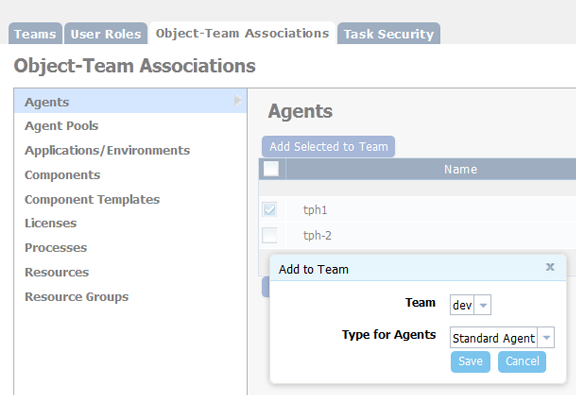
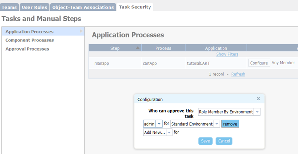

# Migrating security settings

To migrate security settings from uDeploy® 4.8.5 or IBM® uDeploy 5.0 to HCL® UrbanCode™ Deploy, complete these steps.

Read the [Managing security](../../com.udeploy.admin.doc/topics/security_ch.md) topic, which helps you determine the number of teams you need.

**Note:** If you are upgrading from a version before 4.8.5 and you want to upgrade your security settings, you must first upgrade to 4.8.5 or 5.0 before you start this task. If you are upgrading the server but not your security settings, you must be at version 4.8.3 or higher.

The security model in HCL UrbanCode Deploy represents significant changes from previous versions. By completing the migration task, you can secure existing user-created objects instead of individually securing each object after the upgrade.

1.  From within uDeploy 4.8.5 or IBM uDeploy 5.0, open the Migration page by navigating to the migration URL: deploy\_server\_location/\#migration/teams. For example:

    ```
    https://company.com:8443/#migration/teams
    ```

2.  Open the **User Roles** pane to create roles and assign permissions to them. For information about roles, see [Roles and permissions](../../com.udeploy.admin.doc/topics/security_roles.md).Create at least one administrator-type role with all permission, or at a minimum all web UI permissions, and the **Add Team Members** and **Manage Security** permissions from the System security type.

    For information about security types, see [Security types](../../com.udeploy.admin.doc/topics/security_types.md).

    **Note:** The Execute permission is now only used by the Environment security type, and you no longer must grant that permission to other types. To change or modify an item, a user must have the corresponding Edit permission. You can lock items by withholding the Edit permission from a role.

3.  Open the **Teams** pane to create teams and add users and groups to them. All previously created users and groups are available for assignment. For information about creating teams and assigning users, see [Security teams](../../com.udeploy.admin.doc/topics/security_teams.md). 

    **Note:** Users must be assigned to a role when added to a team, so roles must be defined before users and groups can be added to teams.

4.  Open the **Object-Team Mapping** pane. This pane maps objects to the teams that manage security for those objects. This pane shows only the objects that can have their own security settings.The secure-able object types can be seen in the following screen capture.

    

    To map objects, do these steps:

    1.  Select the object type from the object-type list. 
    2.  Select all the objects to assign to the same team from the object list.The **tph1** agent is selected in the accompanying figure. You can select multiple items by holding down the Shift key when you select an item. Use the filter boxes to limit long lists.
    3.  Click **Add Selected to Team**. 
    4.  From the Add a Team dialog box, select the team to assign the selected objects to, and select the security type.
    5.  Click **Save**.
    **Note:** The **Licenses** type is not used and can be ignored.

5.  By default, manual tasks are configured so that any user can use them. To limit a task to a specific role, open the **Task Security** pane, and associate the task with the role. Any application, component, or approval-type task that is used in a process is available to use. To associate tasks with roles, do these steps:
    1.  Select the task type from the task-type list. 
    2.  Open the Configuration dialog box by clicking **Configuration** for the task to use.
    3.  Select a value from the **Who can approve this task** list.Roles can be restricted by environment or application.

        

    4.  Select the role and security type for the task. If you specify the admin role, for example, to use the object, a user must be assigned the admin role. Multiple roles can be selected.
    5.  Save you work.

After you set up security, you are ready to upgrade to HCL UrbanCode Deploy. For information about upgrading, see [Upgrading the server](upgradeInstall.md#). After the upgrade, in addition to the teams that you configured, a System team is created that is granted permissions for all objects that can be secured. Anyone added to a role on the System team is granted all permissions for its objects.

