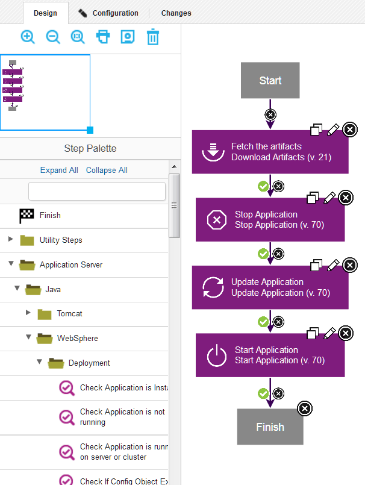

# Plug-ins

HCL® UrbanCode™ Deploy plug-ins provide tools for creating component processes and integrations.HCL UrbanCode Deploy provides plug-ins for several common deployment processes, and others are available to integrate with a wide variety of tools, such as middleware tools, databases, and servers.

Plug-ins provide processing and integration functions. There are two types of plug-ins:

-   Source-type plug-ins integrate with external systems to import artifacts and create component versions.
-   Automation-type plug-ins provide process steps that manipulate components, typically by deploying them.

Both types of plug-ins consist of distinct processes called steps. Each step consists of a number of properties, a command that runs the step, and post-processing instructions. \(Post-processing typically ensures that expected results occur.\) Step properties can serve various purposes, from providing input to the command to supplying some, or all, the actual command itself. Automation-type plug-in properties can be set at design time in the process editor, or at run time in the user interface. Source-type plug-in properties are typically defined when a component is created.

## Automation-type plug-ins

You use automation plug-ins to deploy components or otherwise manage them. Each step is a self-contained unit with inputs, outputs, and properties. By combining automation plug-in steps in the process editor, you can create fully automated deployment processes. When you create a process, you drag steps onto the design area and define the properties as you go. Property values can be specified when you define the process or at run time. The process flow is defined by drawing connections between steps. The following illustration, shows a series of automation-type plug-in steps and the connections between them.

For information about creating component processes, see [Component processes](../../com.udeploy.doc/topics/comp_process.md).

At deployment time, component processes are run by agents that are installed in the target environment. For a process to run, the agent must have access to all resources, tools, and files that are required by the plug-in steps in the process. When you install an agent, ensure that these conditions are met:

-   The agent that runs the process has the necessary user permissions to run commands and can access required resources. Assigning these permissions typically entails granting permissions if an external tool is installed as a different user; installing the agent as a service; or impersonating the appropriate user. See [User impersonation for process steps](../../com.udeploy.doc/topics/arch_appx_sudo.md).
-   External tools that plug-in steps require are installed in the target environment.
-   The required minimum version of an external tool is installed.

For information about installing agents, see [Installing agents from the command line](../../com.udeploy.install.doc/topics/agentInstall.md).

## Source-type plug-ins

You use source plug-ins to import artifacts and create component versions. A source plug-in defines the type of artifacts that can be imported and identifies where the artifacts are located. Source-type plug-ins are configured when components are created, you do not use the process editor to configure source-type plug-ins. Unlike automation plug-ins, source plug-ins always have a single step, the Import Version step.

Artifacts are imported into component versions by agents that are running in the environment where the artifacts are located. For a component version to be created, the agent must have the required permissions and access to all required resources and files. For information about installing agents that run source plug-ins, see [Server settings](../../com.udeploy.admin.doc/topics/settings_system.md).

## Viewing and obtaining plug-ins

A number of plug-ins come with the product and many others are available that can be downloaded and installed. For information about installing plug-ins, see [Installing plug-ins](../../com.udeploy.admin.doc/topics/settings_plugins.md).

View plug-ins that are installed by using the user interface:

-   To view source config plug-ins, click **Settings** \> **Source Config Plugins**. For information on how to use the source config plug-ins that are provided with HCL UrbanCode Deploy, see [Creating components](../../com.udeploy.doc/topics/comp_create.md).
-   To view automation plug-ins, click **Settings** \> **Automation Plugins**

Plug-ins can be developed and updated more frequently than HCL UrbanCode Deploy provides release cycles.

Browse, download, and get documentation for plug-ins at the IBM® developerWorks® site in the [IBM UrbanCode™ Deploy Plug-ins](https://developer.ibm.com/urbancode/plugins/ibm-urbancode-deploy) section. The site contains many more plug-ins than are packaged with the HCL UrbanCode Deploy product.

The site includes plug-ins that are developed by these sources:

-   **IBM® Corporation**

    Your HCL® UrbanCode™ Deploy license entitles you to download and install the plug-ins that are developed by IBM® Corporation.

    Support is provided through the developerWorks® community and through IBM® technical support.

-   **Partners**

    Plug-ins that are provided by partners can be purchased from the partner website.

    Support for each partner plug-in is provided exclusively by the partner who provided the plug-in.

-   **Community**

    Plug-ins are provided by members of the HCL® UrbanCode™ Deploy community on the [HCL® UrbanCode™ Deploy Development Community website](https://developer.ibm.com/urbancode/plugins/development-community/). Search for urbancode or ucplugin to find plug-ins. You can contribute to code in the community or use code posted there to incorporate into your own.

    Support is provided exclusively through the community.

-   **[Creating plug-ins](../../com.udeploy.reference.doc/topics/reference_plugins_create.md)**  
You can create your own plug-ins for use with HCL UrbanCode Deploy. A plug-in consists of XML files and supporting script files that the plug-in requires.
-   **[Example plug-in](../../com.udeploy.reference.doc/topics/reference_plugins_example.md)**  
A plug-in consists of one or more steps. A step represents a unit of functionality that can be user-configured and combined with other steps into a process. Creating a plug-in consists in defining its individual steps and then grouping them together for presentation in HCL UrbanCode Deploy.

**Parent topic:** [Extending product function](../../com.udeploy.doc/topics/c_node_extending.md)

