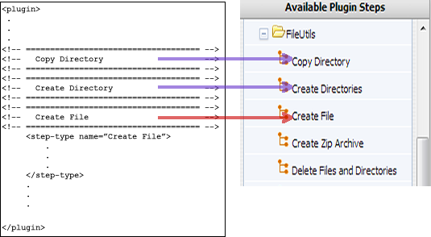
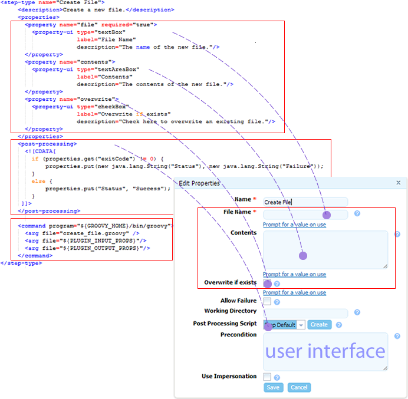

# Example plug-in

A plug-in consists of one or more steps. A step represents a unit of functionality that can be user-configured and combined with other steps into a process. Creating a plug-in consists in defining its individual steps and then grouping them together for presentation in HCL® UrbanCode™ Deploy.

Plug-in steps are run by an agent that is installed in the target environment. This means that plug-ins can be written in any scripting language as long as the agent can access the required scripting tools on the host.

In this section, we examine the mechanics of plug-ins by examining a plug-in step in detail. The example plug-in that we use is FileUtils, which contains several steps that are related to file manipulation. The FileUtils plug-in is shipped with HCL UrbanCode Deploy.

Each plug-in step is an individually configurable object in the editor. In the following illustration, you can see some of FileUtils' individual steps in the process editor.

We examine the `Create File` step in this example. Create File is straightforward and \(as the name implies\) creates a file.

Each step \(step-type element\) has the same structure:

-   `properties` element can contain any number of `<property>` child elements; property values can be supplied at design time or runtime
-   `post-processing` element provides error-handling and sets property values that can be used by other steps
-   `command` element performs the step's function. The function can be defined completely by the element, or be constructed in part or entirely from the step's properties at design time or runtime

The following figure illustrates the structure of the Create File step.

-   **[Step properties](../../com.udeploy.reference.doc/topics/ref_example_step_properties.md)**  
In the context of our discussion, properties are values that are used by the step's command. Step properties are defined with the property element.
-   **[Step commands](../../com.udeploy.reference.doc/topics/ref_example_step_commands.md)**  
The step's `command` element specifies the scripting tool that runs the step and identifies the file that contains the actual script.

**Parent topic:** [Plug-ins](../../com.udeploy.reference.doc/topics/plugin_ch.md)

