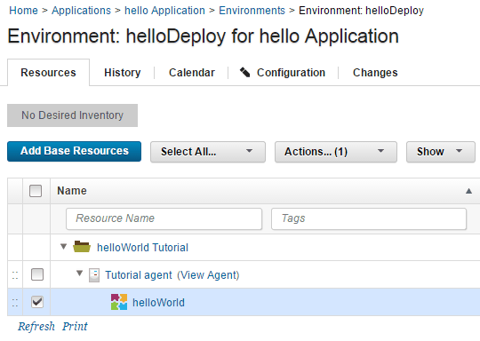
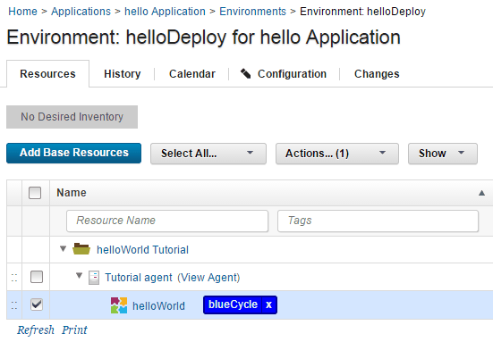

# Lesson 4: Configure an application environment

When you create an environment, you map resources to it that define where the parent application can run deployments.

An environment is a user-defined collection of resources that identify the components that can be deployed by the parent application, along with the agents that do the work.

1.   Define the environment: 
    1.   On the Application: hello Application page, click **Environments**. 
    2.   Click **Create Environment**. 
    3.   Specify the name to be something like helloDeploy. 
    4.   Accept the default values in the other fields in this window, and click **Save**. 
2.   Add the resource group that contains the agent you created earlier to the environment. When you set up the agent, you added the agent as a resource to a resource group.
    1.   Click the environment name. 
    2.   Using the **Resources** tab for the environment, click **Add Base Resources**. The Add Resource to Environment window shows all available resources.
    3.   Select the check box next to resource group that you created earlier, `helloWorld Tutorial`, and then click **OK**. When you select the resource group, you automatically select the resources that are associated with it, such as the agent that you assigned to the group. Selecting an agent-type resource identifies the location, usually a computer, where deployments can occur.
3.   Map the helloWorld component to this agent resource. 
    1.   As you hover the mouse over the row with the agent resource, click **Actions** \> **Add Component**. 
    2.   Select the **helloWorld** component and then click **Save**. Only components added to the parent application are available to be mapped to the agent resource.

        **Note:** In order for a component to be deployed by an application, it must be added to the application and also mapped to an agent-type resource. A component that is added to an application but not mapped to an agent resource, cannot be deployed by that application. Similarly, a component that is mapped to an agent resource but not added to an application, cannot be deployed by that application.

4.   Add a tag to the helloWorld component resource. User-defined tags can identify resources and be referenced in application processes.
    1.   Click the check box for the **helloWorld** component. 
    2.   On the same row as the **Add Base Resources** push button, click **Actions** \> **Add Tag**. The **Add Tag** selection is shown in the following figure:

        

    3.   In the Add New Tag window, type something like blueCycle in the **Name** field, select a color for the tag, and then click **Save**. While you can select any color, blue is a good choice. Applications can be configured to use resources with a specific tag. For example, a continually running environment might take one group of blueCycle tagged servers offline to update them, then put them back online and take another differently tagged group offline. You can also configure a process to deploy all components with a particular tag. The finished resource with the blueCycle tag is shown in the following figure:

        

The new environment is displayed on the **Environments** tab. After the environment is prepared, you can create the application process.

In this lesson, you created an environment and added a resource group to it, then added a tag to the resource.

On the **Resources** tab, you have the resource group with your agent and the `helloWorld` component.

For more information about creating environments, see [Application environments](../../com.udeploy.doc/topics/app_environment.md).

**Parent topic:** [Create a simple helloWorld deployment](../../com.udeploy.tutorial.doc/topics/quickstart_abstract.md)

