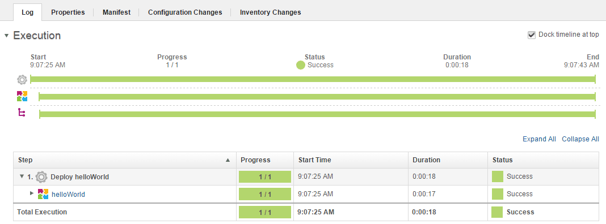
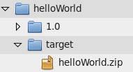

# Lesson 6: Deploy the component

To deploy the component, run the application process on an environment.

Using the application environment and process that you created in previous steps, you can deploy the component.

1.  Open the application page by clicking **Applications** and then clicking the application name.
2.  In the same row as your environment, click the **Request Process** icon .
3.  In the Run Process window, accept the default value for the **Only Changed Versions** parameter. If this check box is selected, no previously deployed component versions are deployed.
4.  In the **Process** list, select the **hello App Process** process.
5.  Click **Choose Versions**. The Component Versions window opens.
6.  In the Component Versions window, click **Select For All**, and then select **Latest Available**. Click **OK** to return to the Run Process window.
7.  Click **Submit**.The Application Process Request page shows the progress of the request. From here, you can watch as the process runs. The following figure shows the running process.

    

    If the process finishes, the **Success** status is shown, as in the following figure:

    

    If the application process execution is not successful, click **Expand All** and in the same row as your application process, click **View Child Execution**. **View Child Exection** does not appear until you hover the mouse over the process. The Deployment of Component page shows the log for each step in the component process. From here, you can look at the output log for each step by clicking the **Output Log** icon .

8.  Open the target directory to confirm that the component artifacts are deployed.

The `helloWorld.zip` file is moved to the location that you specified in the `helloHome` property, as shown in the following figure:

The application process installed the helloWorld component into the target environment.

Application processes can also uninstall or update components or run other configuration.

For more information about running deployments, see [Deploying applications](../../com.udeploy.doc/topics/deployment_ch.md).

**Parent topic:** [Create a simple helloWorld deployment](../../com.udeploy.tutorial.doc/topics/quickstart_abstract.md)

