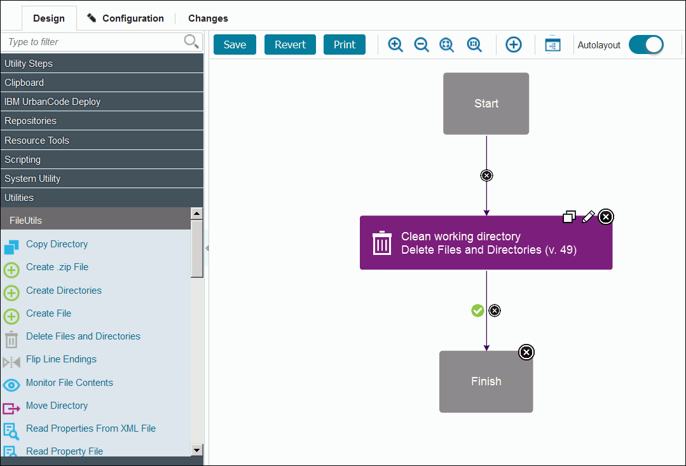
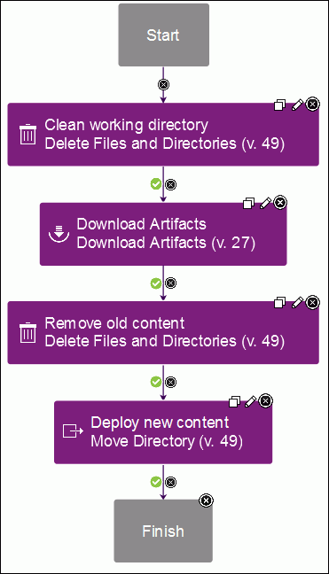
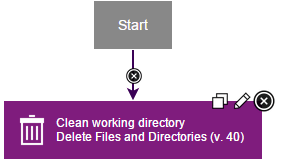
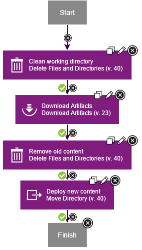
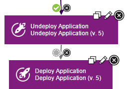
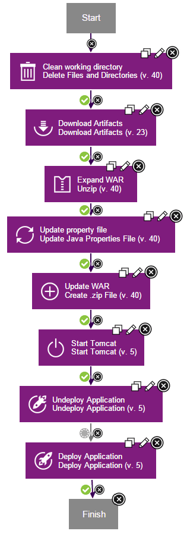
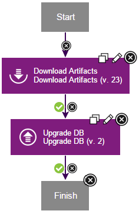

# Lesson 2: Creating component processes

Component processes describe automated tasks that run on components. Component processes can deploy, install, uninstall, update, or run other tasks on a component.

There are three types of processes:

-   Generic processes run outside the context of components or applications. Generic processes are shown on the top-level **Processes** tab. You can use generic processes in these instances, for example:
    -   In conjunction with a number of different component processes that do not fit well into a component template
    -   When you want to run processes that directly affect HCL® UrbanCode™ Deploy agents that are unrelated to component, such as changing the agent configuration
-   Application processes run within the context of applications. In many cases, application processes call component processes. For example, an application process can call the component processes that deploy their associated components.
-   Component processes run tasks on a single component, such as deploying it, uninstalling it, or running configuration tasks on it.

Processes are lists of steps and connections between those steps. Each step is an individual command that runs on a target computer. Steps can manipulate files, run system commands, download files, and run programs. Plug-ins contribute most of these steps; plug-ins are available that work with many different types of software. For information about steps that are provided by plug-ins, see the documentation for the individual plug-in on IBM® developerWorks®: [IBM UrbanCode™ Deploy Plug-ins](https://developer.ibm.com/urbancode/plugins/ibm-urbancode-deploy).

Each component must have at least one component process to deploy or install the component. In this lesson, you create a deployment process for each of the three components. Later, you create an application process that calls these component processes to deploy each component.

**Parent topic:** [Deploying a simple web application](../../com.udeploy.tutorial.doc/topics/webapp_abstract.md)

## Creating a component process for the web component

The component process for the web component downloads the most recent version of the component artifacts and puts those artifacts in the correct folder.

Follow these steps to create the component process that deploys the web component:

1.   On the **Components** tab, click the **JPetStore-WEB** component. 
2.   Click **Processes**, and then click **Create Process**. 
3.   In the Create Process window, specify the name to be Deploy web component. 
4.   In the **Process Type** list, select **Deployment**. This list has other options for processes that uninstall or configure components.
5.   Accept the default values for the other properties, and click **Save**. The process opens in the process editor. This editor shows the steps in the process in a graphical form, as a flowchart. The **Start** and **Finish** boxes represent the beginning and the end of the process. From here, you add steps to the process and link them between the **Start** and **Finish** steps to show the order of the steps.
6.   Add a step to clean any files out of the working directory. The process runs within a working directory. To ensure that you are using the most recent version of the files in the web component, run a command to clean the working directory:

    1.   At the left of the process editor, in the step palette, expand **Utilities**. The step palette menu shows the available steps. You can explore the palette categories to find steps, or you can type in the search box at the top of the window.
    2.   Under **FileUtils**, click and drag the **Delete Files and Directories** step to the process editor. The step is inserted between the **Start** and **Finish** steps. The inserted step is automatically connected to these steps Edit Properties window opens, showing the properties for the step. Some of these properties are unique to the step and others are the same for all steps.
    3.   Click the **Edit** icon , and the Edit Properties window opens. In the **Name** field, specify the name to be Clean working directory. 
    4.   In the **Base Directory** field, specify a single period \(`.`\). 
    5.   In the **Include** field, specify the following code: 

        ```
        **/*
        ```

    6.   Accept the defaults for the other properties and then click **OK**. 
    The new step is displayed as a box in the process editor. The process editor looks like the following figure:

    

7.   Add a step to download the latest version of the component artifacts. The **Download Artifacts** step is used in most deployment processes. This step downloads the specified version of the component artifacts to the target computer. When you run the process, you will specify whether to use the most recent version of the component artifacts or a specific version.
    1.  **Tip:** When you drag the first step into a process editor, that step is automatically connected to the **Start** and **Finish** steps. When you drag subsequent steps into the process editor, place the cursor in the target position so that the connection arrow is highlighted, and then place the step. The new step is automatically connected. You can always change step locations and manually connect steps later.

         In the step palette, expand **Repositories**, and under Artifact/HCL UrbanCode Deploy, drag the **Download Artifacts** step to the process editor. 

    2.   Click the **Edit** icon , and in the Edit Properties window, accept the default values; then, click **OK**. 
8.   Add a step to remove the old web content from the server: 
    1.   Expand **Utilities**, and under FileUtils, drag another **Delete Files and Directories** step to the process editor. 
    2.   In the Edit Properties window \(click the **Edit** icon\), and specify the name as Remove old content. 
    3.   In the **Base Directory** field, specify the following directory: 

        ```
        webapps/${p:environment/tomcat.contextroot}
        ```

        The variable represents the location where Tomcat stores your deployed files. You specify a value for this variable later.

    4.   In the **Include** field, specify the following directory: 

        ```
        images
        ```

    5.   In the **Working Directory** field, specify the following variable: 

        ```
        ${p:environment/tomcat.home}
        ```

        This variable represents the main folder of the Tomcat web server. You will specify a value for this variable later.

    6.   Accept the default values in the other fields, and click **OK**. 
9.   Add a step to deploy the new content to the server. This step copies the component artifacts to the application server.

    1.   Expand **Utilities** and under **FileUtils**, drag a **Move Directory** step to the process editor. 
    2.   In the Edit Properties window, specify the name to be Deploy new content. 
    3.   Click the **Edit** icon, and in the **Source Directory** field, specify a single period \(`.`\). 
    4.   In the **Destination Directory** field, specify the following directory: 

        ```
        ${p:environment/tomcat.home}/webapps/${p:environment/tomcat.contextroot}/
        ```

    5.   In the **Include Files** field, specify the following code: 

        ```
        images/*
        ```

    6.   Accept the default values in the other fields and click **OK**. 
    Now the process has four steps, as in the following figure:

    

10. Each step has three icons at the upper right corner of the step. The **Edit** icon  opens the Edit Properties window. The X icon  deletes the step. The Copy icon  copies the step to the **Clipboard** folder so you can duplicate it.

    Also, if you move the mouse over a step, an arrow icon is displayed over the center of the step. This icon is used to manually create links between steps.

    

11.  If your steps are not connected or are not connected in the correct order, you can connect the steps manually: 

    1.   If the steps are not in the correct order, remove the connection link between steps by clicking the **X** icons on any of the link arrows; then, rearrange the steps in the correct order. 
    2.   Move the mouse over the **Start** step, and drag the arrow icon to the `Clean working directory` step. The arrow between these steps represents the flow of activity from one step to another, as in the following figure:

        

    3.   Similarly, drag an arrow from the `Clean working directory` step to the `Download Artifacts` step. 
    4.   Drag an arrow from the `Download Artifacts` step to the `Remove old content` step. 
    5.   Drag an arrow from the `Remove old content` step to the `Deploy new content` step. 
    6.   Drag an arrow from the `Deploy new content` step to the `Finish` step. 
    You can connect steps in a sequence like these steps, or you can run steps in parallel with each other by creating more links. However, processes always start with the **Start** step and end with the **Finish** step. The sequence of steps in this process is as follows:

    1.  `Start`
    2.  `Clean working directory`
    3.  `Download Artifacts`
    4.  `Remove old content`
    5.  `Deploy new content`
    6.  `Finish`
12.  Save the process by clicking **Save**. 

The complete component process for the web component looks like the following figure:



## Creating a component process for the application component

The application component consists of a single WAR file. This component process downloads the most recent version of the WAR file, updates values in the file, and deploys the file on the application server.

1.   From the **Components** tab, click the **JPetStore-APP** component. 
2.   Click **Processes**, and then click **Create Process**. 
3.   In the Create Process window, specify the name as Deploy application component. 
4.   In the **Process Type** list, select **Deployment**. 
5.   Accept the default values for the other properties, and click **Save**. 
6.   In the process editor, add a step to clean the working directory. As you did for the web component, add a **Delete Files and Directories** step named Clean working directory, and specify a period in the **Base Directory** field and `**/*` in the **Include** field.
7.   Add a step to download the artifacts. As you did for the web component, add a `Download Artifacts` step, and accept the default properties.
8.   Add a step to extract the WAR file. You must extract the WAR file so you can update a property file with the database connection information.
    1.   In the list of available steps, expand **Utilities**, and under FileUtils, drag an **Unzip** step to the process editor. 
    2.   Specify the name as Expand WAR. 
    3.   In the **Extract directory** field, specify the following code: 

        ```
        ./JPetStore_expanded
        ```

    4.   In the **.zip files** field, specify the following file: 

        ```
        JPetStore.war
        ```

    5.   In the **Include Files** field, specify the following code: 

        ```
        **/*
        ```

    6.   Click **OK**. 
9.   Add a step to update the property file with the location of the database: 
    1.   In the list of available steps, expand **Utilities**, and from FileUtils add an **Update Java Properties File** step to the process editor. 
    2.   Specify the name as Update property file. 
    3.   In the **Directory Offset** field, specify the following folder: 

        ```
        ./JPetStore_expanded/WEB-INF/classes/properties
        ```

    4.   In the **File Includes** field, specify the following file: 

        ```
        database.properties
        ```

    5.   In the **Add/Update properties** field, specify the following code: 

        ```
        url=${p:environment/db.url}
        ```

        This code updates the url property in the property file with the location of the database. The `${p:environment/db.url}` code is a variable that represents the location of the database component when the application is deployed.

    6.   Click **OK**. 
10.  Add a step to update the WAR file with the new property file: 
    1.   From the list of available steps, expand the **Utilities**, and from FileUtils, add a **Create .zip File** step to the process editor. 
    2.   Specify the name as Update WAR. 
    3.   In the **.zip File Name** field, specify the JPetStore.war file. 
    4.   In the **Base Directory** field, specify the following folder: 

        ```
        ./JPetStore_expanded
        ```

    5.   In the **Include** field, specify the following code: 

        ```
        **/*
        ```

    6.   Select the **Update Existing** check box. 
    7.   Click **OK**. 
11.  Add a step to start Tomcat: 
    1.   In the list of available steps, expand **Application Server**, and from Java/Tomcat, add a **Start Tomcat** step to the process editor. If this step is not in the tree, install the Tomcat plug-in as described in the [Prerequisites](webapp_intro.md#prereqs) for this tutorial.
    2.   Accept the default name Start Tomcat. 
    3.   In the **Launcher** field, specify the following code: 

        ```
        ${p:environment/tomcat.start}
        ```

        This code is another variable that represents the command to start Tomcat.

    4.   In the **Startup timeout \(in seconds\)** field, specify 60. 
    5.   In the **Port** field, specify the port 8081. 
    6.   Click **OK**. 
12.  Add a step to remove any previous versions of the application: 
    1.   In the list of available steps, expand **Application Server**, and from Java/Tomcat, add an **Undeploy Application** step to the process editor. 
    2.   Accept the default name Undeploy Application. 
    3.   In the **Tomcat Manager URL** field, specify the following code: 

        ```
        ${p:environment/tomcat.manager.url}
        ```

    4.   In the **Tomcat Manager User Name** field, specify the user name for the Tomcat server. You specified this user name and its password in [Configuring the agent and target system](webapp_configure_agent.md). If you used the code examples from that topic, the user name and password are tomcatmanager.
    5.   In the **Tomcat Manager Password** field, specify the password for the Tomcat server. 
    6.   In the **Context Name** field, specify the following context name, including the preceding forward slash: 

        ```
        /${p:environment/tomcat.contextroot}
        ```

        Ensure that you include a slash \(/\) before the variable.

    7.   Click **OK**. 
13.  Add a step to deploy the updated WAR file to the application server: 
    1.   In the list of available steps, expand **Application Server**, and from Java/Tomcat, add a **Deploy Application** step to the process editor. 
    2.   Accept the default name Deploy Application. 
    3.   In the **Tomcat Manager URL** field, specify the following code: 

        ```
        ${p:environment/tomcat.manager.url}
        ```

    4.   In the **Tomcat Manager User Name** field, specify the user name for the Tomcat server. 
    5.   In the **Tomcat Manager Password** field, specify the password for the Tomcat server. 
    6.   In the **Context Name** field, specify the following context name: 

        ```
        /${p:environment/tomcat.contextroot}
        ```

        Ensure that you include a slash \(/\) before the variable.

    7.   In the **War File Path** field, specify the following path: 

        ```
        ./JPetStore.war
        ```

    8.   Click **OK**. 
14.  If required, arrange and connect the steps in the following order: 
    1.  `Start`
    2.  `Clean working directory`
    3.  `Download Artifacts`
    4.  `Expand WAR`
    5.  `Update Property File`
    6.  `Update WAR`
    7.  `Start Tomcat`
    8.  `Undeploy Application`
    9.  `Deploy Application`
    10. `Finish`
15.  Change the conditional flag on the link between the `Undeploy Application` and `Deploy Application` steps to `both` by clicking the green check mark on the connection until it turns to a gray circle, as shown in the following figure: 

    

    Each connection from one step to another has a conditional flag. The conditional flag specifies a condition for the connection. Three conditional flags are available:

    -   By default, the conditional flag on each connection is set to `success`, which is represented by a green check mark. The process follows these connections when the step succeeds.
    -   The conditional flag `fail` is represented by an exclamation point \(!\) in a red field. The process follows these connections when steps fail.
    -   The conditional flag `both` is represented by a gray circle. The process follows these connections regardless of whether a step succeeds or fails.
    The `Undeploy Application` step fails if no previous versions of the application are installed. In this case, setting the conditional flag on the connection to `both` specifies that the process keeps running regardless of whether the step fails or succeeds.

16.  Save the process. 

The complete component process for the application component looks like the following figure:



## Creating a component process for the database component

The deployment process for the database component updates the database with sample values.

1.   From the **Components** tab, click the `JPetStore-DB` component. 
2.   Click **Processes**, and then click **Create Process**. 
3.   In the Create Process window, specify the name as Deploy database component. 
4.   In the **Process Type** list, select **Deployment**. 
5.   Accept the default values for the other properties, and click **Save**. 
6.   In the process editor, add a step to download the artifacts. As you did for the web component, add a `Download Artifacts` step, and accept the default properties.
7.   Add a step to update the database: 
    1.   In the list of available steps, expand **Database**, and under DBUpgrader, add an **Upgrade DB** step to the process editor. If this step is not in the tree, install the database upgrade plug-in as described in the [Prerequisites](webapp_intro.md#prereqs) for this tutorial.
    2.   In the Edit Properties window, in the **Name** field, accept the default value of Upgrade DB. 
    3.   In the **Driver Classname** field, specify the following class: 

        ```
        com.mysql.jdbc.Driver
        ```

    4.   In the **DB Driver Jar** field, specify the following path: 

        ```
        lib/mysql-connector-java-5.1.20-bin.jar
        ```

        This file is provided in the source code for the component.

    5.   In the **URL** field, specify the following variable: 

        ```
        ${p:environment/db.url}
        ```

    6.   In the **User** field, specify the user ID of the database user. If you used the examples in [Configuring the agent and target system](webapp_configure_agent.md), the user ID is jpetstore.
    7.   In the **Password** field, specify the password of the database user. If you used the examples in [Configuring the agent and target system](webapp_configure_agent.md), the password is jppwd.
    8.   In the **SQL File path** field, specify a single period: `.` . 
    9.   In the **SQL File Include** field, specify the extension `*.xml` . 
    10.  In the **Current Version SQL** field, specify the following SQL code: 

        ```
        SELECT VER FROM DB_VERSION WHERE RELEASE_NAME = ?
        ```

    11.  In the **Delete Version SQL** field, specify the following SQL code: 

        ```
        DELETE FROM DB_VERSION WHERE RELEASE_NAME = ?
        ```

    12.  In the **Update Version SQL** field, specify the following SQL code: 

        ```
        INSERT INTO DB_VERSION (RELEASE_NAME,VER) VALUES(?,?)
        ```

    13.  Click **OK**. 
8.   If required, arrange and connect the steps in the following order: 
    1.  `Start`
    2.  `Download Artifacts`
    3.  `Upgrade DB`
    4.  `Finish`
9.   Save the process. 

The complete component process for the database component looks like the following figure:



In this lesson, you created component processes to deploy the components.

You can use component processes to automate many different tasks on components. However, you generally do not run component processes directly; in most cases, you add them to application processes. Later in this tutorial, you will create an application process for these three component processes.

Processes consist of steps, which are provided by plug-ins. To see a list of plug-ins that are available, and for documentation on those plug-ins and steps, see IBM developerWorks: [UrbanCode Deploy Plug-ins](https://developer.ibm.com/urbancode/plugins/ibm-urbancode-deploy).

