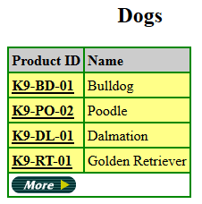
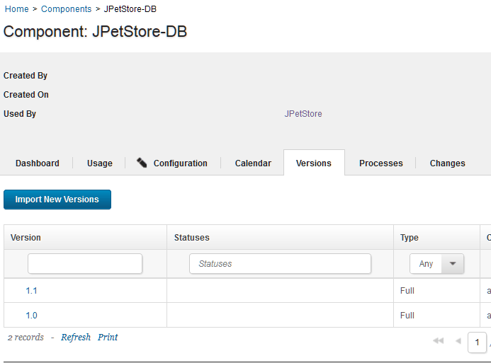
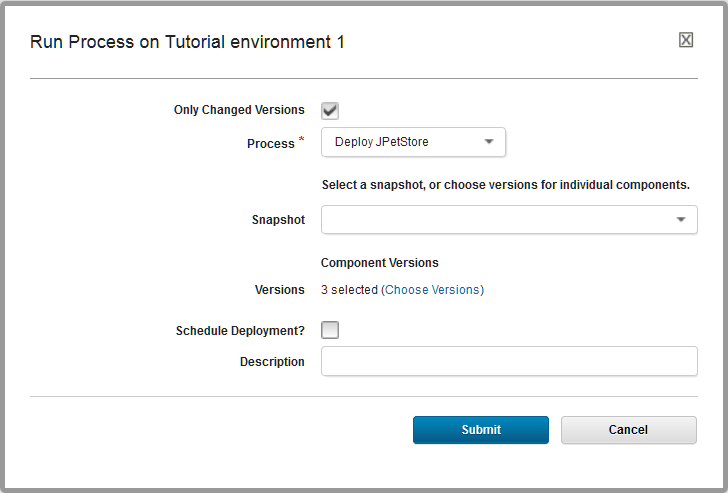
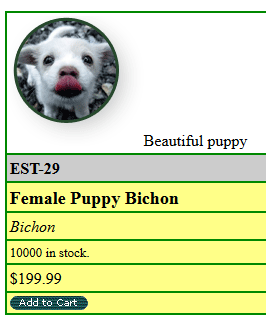

# Lesson 6: Updating the application

In the first lesson, you deleted certain versions of the components. In this lesson, you add those versions again to simulate deploying a new version of the components.

The web application that you deployed in the previous lesson included version 1.0 of the web component and database component. Version 1.1 of these components includes a new item for the online store: a Bichon in the Dogs category.

1.  Verify that `Bichon` is not available in the Dogs category: 
    1.  Open the application by opening a web browser to the following URL:

        ```
        http://hostname:8081/JPetStoreDev
        ```

    2.  Click **Enter the Store**. 
    3.  Browse the Dogs category and verify that `Bichon` is not available.The following figure shows some of the dogs in this category:

        

2.  Import the new version of the database component: 

    1.  On the HCL® UrbanCode™ Deploy server, click the **Components** tab and then click the JPetStore-DB component.
    2.  Click the **Versions** tab and then click **Import New Versions**.Now, version 1.1 is shown in the list of versions, as shown in the following figure:

        

    3.  Click the new version of the database component to open its information page.
    4.  Click the **Configuration** tab. 
    5.  Under **Basic Settings**, in the **Type** list, select **Incremental** and then click **Save**. 
    This version is set to be an incremental upgrade rather than a new version. Full versions are installed directly, without installing prior versions first. Incremental upgrades start with prior versions, and then the new version is installed over the prior versions. The new database version is only an addition to the database, so it requires the prior version of the component.

3.  In the same way, import version 1.1 of the web component without changing the **Type** setting.The application component does not have any additional versions.
4.  Click **Applications** and then click the JPetStore application to get back to the list of environments. 
5.  On the environment, run the application process again. In the Run Process window, be sure to select the latest version for each of the components by clicking **Choose Versions** and then clicking **Select For All** \> **Latest Available**. Optionally, you can select the **Only Changed Versions** check box so that the server deploys only the components with new versions. In this case, the server runs the component processes only for the web and database components.

    

6.  In your web browser, reload the web application and explore the Dogs category to see the new `Bichon`, as shown in the following figure:

    

    This new item demonstrates that the database component is updated to version 1.1

7.  Click the Product ID for `Bichon` and then the Item ID to see the product page for `Bichon`. The new graphic for this item demonstrates that the web component is updated to version 1.1.

    


Now the application includes the new versions of the components.

In a production scenario, new versions of components might become available frequently. You can run the application process as often as necessary to update the deployed components. You can also configure the application process to run automatically when new versions of the components are available.

Now that you have completed this tutorial, you can continue learning about how to deploy components by using snapshots. See the tutorial [Creating and deploying snapshots](snapshot_abstract.md).

**Parent topic:** [Deploying a simple web application](../../com.udeploy.tutorial.doc/topics/webapp_abstract.md)

